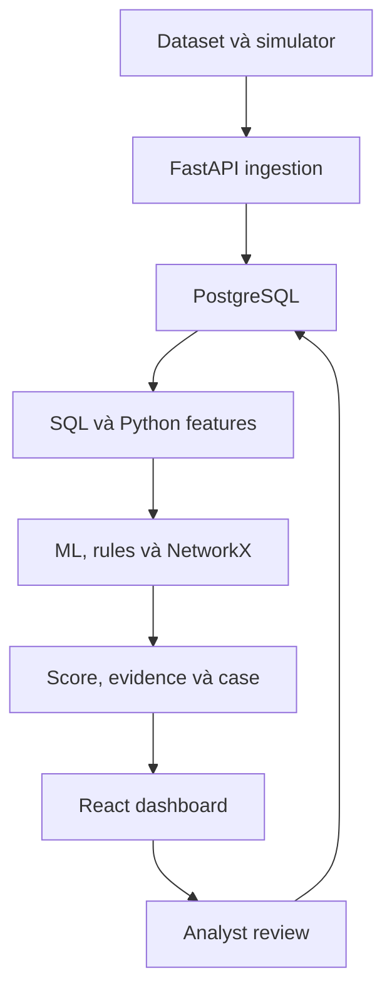
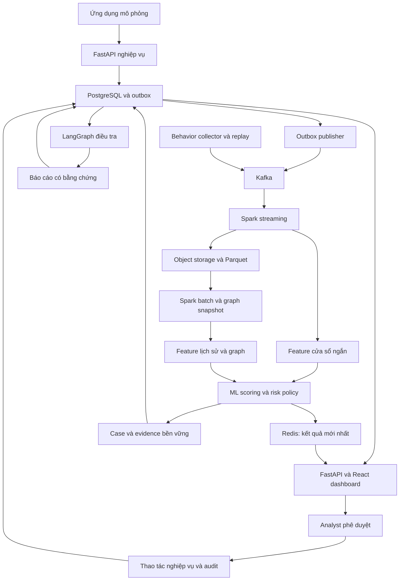

# Lộ trình 5 tháng: từ MVP đến hệ thống phát hiện bot và tài khoản nghi vấn

**Đề tài:** AI Agent hỗ trợ phát hiện hành vi bất thường, tài khoản giả mạo và bot, kết hợp phân tích hành vi với quan hệ giữa các tài khoản.

**Phạm vi triển khai đề xuất:** hệ thống theo dõi sự kiện trên một nền tảng thương mại điện tử mô phỏng, ưu tiên bot tự động hóa và lạm dụng ưu đãi bằng nhiều tài khoản. Nếu phạm vi chính thức là ví điện tử như ảnh mô tả đề tài, giữ nguyên kiến trúc và thay các sự kiện mua sắm bằng đăng ký, giao dịch, nhận và sử dụng ưu đãi; cần chốt domain ở tuần 1.

**Thời lượng:** 20 tuần làm việc, chia thành 5 giai đoạn. Năm tháng theo lịch có thể dài hơn 20 tuần; phần thời gian còn lại dùng làm dự phòng, chỉnh báo cáo và chuẩn bị bảo vệ.

**Bản cập nhật 05/10/2026:** bổ sung hướng dẫn nguồn dữ liệu, tải/crawl, Docker theo từng tháng, triển khai staging/production, backup/restore, rollback và xử lý sự cố. Phần 1–16 là kế hoạch và phương pháp; phần 17–23 là cẩm nang triển khai tương ứng.

**Cách đọc phần lệnh/cấu hình:** đây là thiết kế và template cho dự án sắp xây, chưa phải source code của một ứng dụng đã được triển khai. Các CLI `python -m ...`, script Spark, endpoint demo và biến cấu hình riêng của ứng dụng là hợp đồng cần implement theo phần 23. Docker/Kaggle/Scrapy CLI là lệnh của công cụ; image và connector phải được chọn, khóa phiên bản rồi smoke-test trên máy thực tế. Không suy ra “đã kiểm chứng runtime” chỉ từ một file hướng dẫn.

**Giả định nguồn lực:** một người triển khai chính, có máy phát triển và có thể thuê hoặc mượn thêm máy cho benchmark. Đây là kế hoạch xây sản phẩm thử nghiệm hoàn chỉnh phục vụ khóa luận; vận hành thương mại quy mô lớn cần thêm thời gian và nguồn lực.

> Trục chính của đề tài là **dữ liệu → feature → detector → bằng chứng → analyst review**. PostgreSQL, Kafka và Spark giúp trục này hoạt động ở các quy mô khác nhau. AI Agent điều tra và giải thích; ML tạo điểm nghi vấn. Khóa tài khoản hoặc thu hồi ưu đãi luôn cần người có quyền phê duyệt.

## Mục lục

1. [Sản phẩm cuối cùng và phạm vi](#1-sản-phẩm-cuối-cùng-và-phạm-vi)
2. [Các mốc trong 5 tháng](#2-các-mốc-trong-5-tháng)
3. [Công nghệ và thời điểm sử dụng](#3-công-nghệ-và-thời-điểm-sử-dụng)
4. [Kiến trúc từ MVP đến sản phẩm](#4-kiến-trúc-từ-mvp-đến-sản-phẩm)
5. [Chiến lược dữ liệu và nhãn](#5-chiến-lược-dữ-liệu-và-nhãn)
6. [Cơ chế detection cần xây](#6-cơ-chế-detection-cần-xây)
7. [Tháng 1: dữ liệu, backend và dashboard nền tảng](#7-tháng-1-dữ-liệu-backend-và-dashboard-nền-tảng)
8. [Tháng 2: MVP detection và xử lý case](#8-tháng-2-mvp-detection-và-xử-lý-case)
9. [Tháng 3: pipeline Big Data](#9-tháng-3-pipeline-big-data)
10. [Tháng 4: streaming, graph và Agent](#10-tháng-4-streaming-graph-và-agent)
11. [Tháng 5: kiểm chứng, hoàn thiện và triển khai](#11-tháng-5-kiểm-chứng-hoàn-thiện-và-triển-khai)
12. [Thiết kế database, API và cấu trúc dự án](#12-thiết-kế-database-api-và-cấu-trúc-dự-án)
13. [Thực nghiệm và tiêu chí nghiệm thu](#13-thực-nghiệm-và-tiêu-chí-nghiệm-thu)
14. [Nguồn lực, rủi ro và phương án giảm phạm vi](#14-nguồn-lực-rủi-ro-và-phương-án-giảm-phạm-vi)
15. [Checklist sản phẩm cuối cùng](#15-checklist-sản-phẩm-cuối-cùng)
16. [Tài liệu kỹ thuật tham khảo](#16-tài-liệu-kỹ-thuật-tham-khảo)
17. [Nguồn dataset và quy trình tải dữ liệu](#17-nguồn-dataset-và-quy-trình-tải-dữ-liệu)
18. [Crawl và thu thập dữ liệu bổ sung](#18-crawl-và-thu-thập-dữ-liệu-bổ-sung)
19. [Docker: nền tảng, cấu hình và image](#19-docker-nền-tảng-cấu-hình-và-image)
20. [Runbook Docker theo từng tháng](#20-runbook-docker-theo-từng-tháng)
21. [Deploy staging và sản phẩm thử nghiệm](#21-deploy-staging-và-sản-phẩm-thử-nghiệm)
22. [Vận hành, backup, rollback và xử lý sự cố](#22-vận-hành-backup-rollback-và-xử-lý-sự-cố)
23. [Hợp đồng CLI, thứ tự triển khai và bàn giao](#23-hợp-đồng-cli-thứ-tự-triển-khai-và-bàn-giao)

## 1. Sản phẩm cuối cùng và phạm vi

### 1.1. Sản phẩm phải thực hiện được những gì?

1. Nhận sự kiện từ ứng dụng mô phỏng hoặc chương trình replay dataset.
2. Chuẩn hóa và lưu lịch sử sự kiện để xử lý lại.
3. Tính feature theo tài khoản, session và cửa sổ thời gian.
4. Phát hiện bất thường ở tài khoản và dấu hiệu phối hợp giữa nhiều tài khoản.
5. Tạo kết quả đánh giá có phiên bản model, thời điểm, feature và bằng chứng đi kèm.
6. Gom các cảnh báo liên quan thành case để analyst điều tra.
7. Hiển thị timeline hành vi, đồ thị liên kết và lý do bị gắn cờ.
8. Cho Agent truy xuất bằng chứng, tạo báo cáo và đề xuất bước xử lý.
9. Cho analyst xác nhận, bác bỏ hoặc tiếp tục theo dõi; thao tác khóa/thu hồi phải qua phê duyệt.
10. Lưu audit, kết luận và nhãn phản hồi để phục vụ đánh giá và huấn luyện sau này.

### 1.2. Phân biệt ba mục tiêu detection

| Mục tiêu | Ý nghĩa | Đầu ra nên dùng |
| --- | --- | --- |
| Bất thường | Hành vi khác phân bố tham chiếu | Anomaly score, lý do cần xem xét |
| Bot | Có dấu hiệu tự động hóa | Bot score hoặc xác suất khi đã kiểm định calibration |
| Tài khoản phối hợp/lạm dụng | Nhiều tài khoản liên quan cùng thực hiện một mục đích đáng nghi | Cluster risk, promo-abuse score, case có bằng chứng |

**Bất thường không đồng nghĩa bot; bot không mặc nhiên là gian lận.** Hành vi mua hàng hoặc đăng ký cũng chưa đủ để chứng minh một danh tính giả. Trong phạm vi này, kết luận phù hợp là “nghi vấn tài khoản phối hợp/lạm dụng”; xác minh danh tính thật cần nguồn dữ liệu khác và quy trình nghiệp vụ riêng.

### 1.3. Phạm vi bắt buộc và mở rộng

| Mức | Chức năng |
| --- | --- |
| Bắt buộc | Ingestion, feature engineering, baseline ML, graph features, case management, analyst review, audit, dashboard, Agent có bằng chứng, benchmark |
| Có điều kiện | XGBoost khi có nhãn đủ chất lượng; calibration khi có validation phù hợp; GraphFrames khi graph đủ lớn và môi trường tương thích |
| Mở rộng | RAG, pgvector, community detection sâu hơn, feedback retraining tự động có kiểm soát |
| Chưa đưa vào 5 tháng | Kubernetes, nhiều microservice, GNN, Transformer cho chuỗi hành vi, triển khai đa vùng, tự động khóa không có phê duyệt |

Không xây một website thương mại điện tử đầy đủ. Chỉ cần ứng dụng hoặc simulator sinh các luồng nghiệp vụ phục vụ detection; giao diện chính là dashboard cho analyst/admin.

## 2. Các mốc trong 5 tháng

| Giai đoạn | Tuần | Mục tiêu | Quy mô dữ liệu tham khảo | Đầu ra phải demo được |
| --- | --- | --- | --- | --- |
| Tháng 1 | 1–4 | Nền tảng dữ liệu và ứng dụng | 100 nghìn → 1 triệu → 5 triệu event nếu tài nguyên cho phép | Import/replay dữ liệu, truy vấn tài khoản, xem timeline, đăng nhập phân quyền |
| Tháng 2 | 5–8 | MVP detection hoàn chỉnh | Sample đủ tính feature và nhãn; stress test 5–10 triệu event | Event → feature → ML → case → analyst → audit |
| Tháng 3 | 9–12 | Pipeline xử lý dữ liệu lớn | 10 → 50 triệu event; tăng sau khi đo tài nguyên | Kafka → Spark → Parquet; nghiệp vụ PostgreSQL tiếp tục hoạt động |
| Tháng 4 | 13–16 | Gần thời gian thực, graph quy mô lớn, Agent | Replay tăng tải từng mức | Score tự cập nhật, cluster được phát hiện, Agent báo cáo có dẫn chứng |
| Tháng 5 | 17–20 | Thực nghiệm, ổn định, triển khai, báo cáo | 50–100 triệu hoặc lớn hơn nếu đủ tài nguyên | Sản phẩm chạy trên môi trường đích, benchmark tái lập được, demo và báo cáo |

Các mức record và tốc độ trong tài liệu là **mục tiêu thử nghiệm**, không phải cam kết hiệu năng. Không bắt buộc tải hàng chục triệu event vào PostgreSQL để hoàn thành MVP, và không giả định Spark sẽ thắng PostgreSQL ở một số dòng cố định.

**Cổng hoàn thành:** tuần 4 có nền tảng; tuần 8 có MVP end-to-end; tuần 12 có pipeline mới đối chiếu được với bản cũ; tuần 16 có streaming và Agent; tuần 20 có sản phẩm thử nghiệm cùng bằng chứng đánh giá.

## 3. Công nghệ và thời điểm sử dụng

### 3.1. Stack đề xuất

| Thành phần | Công nghệ chọn | Bắt đầu | Vai trò |
| --- | --- | --- | --- |
| Ngôn ngữ backend/data | Python | Tháng 1 | API, ETL, feature, model, simulator, Agent |
| Backend API | FastAPI + Pydantic | Tháng 1 | Ingestion, đọc case, review, kiểm tra schema |
| Database nghiệp vụ | PostgreSQL | Tháng 1 → cuối | Tài khoản, trạng thái, case, review, audit, metadata model |
| ORM/migration | SQLAlchemy + Alembic; psycopg cho COPY | Tháng 1 | Quản lý transaction, schema và bulk import |
| Frontend | React + TypeScript + Vite | Tháng 1 | Dashboard analyst/admin |
| UI/data fetching | Tailwind CSS + TanStack Query | Tháng 1 | Bảng, bộ lọc, trạng thái tải, refresh kết quả |
| Đồ thị trên UI | Cytoscape.js | Tháng 2 | Xem subgraph có giới hạn kích thước |
| Feature trên sample | SQL + Pandas + PyArrow | Tháng 1–2 | Aggregate trong DB, xử lý bảng feature vừa RAM, đọc/ghi Parquet |
| Graph prototype | NetworkX | Tháng 2 | Kiểm tra graph features trên sample |
| ML baseline | scikit-learn: Isolation Forest, Logistic Regression | Tháng 2 | Anomaly detection và baseline có nhãn |
| Model có nhãn chính | XGBoost | Tháng 2 nếu dữ liệu sẵn sàng | Phân loại bot hoặc promo abuse trên feature tổng hợp |
| Giải thích model | SHAP + reason codes từ rule | Tháng 2–4 | Cho biết feature đóng góp vào dự đoán, bổ sung bằng chứng |
| Event bus | Apache Kafka + Python Kafka client | Tháng 3 | Vận chuyển event, buffering và replay |
| Batch/stream processing | Apache Spark + PySpark | Tháng 3–4 | ETL, aggregate feature, window gần thời gian thực |
| Lưu trữ dữ liệu lớn | Object storage tương thích S3 + Parquet; MinIO là lựa chọn có điều kiện | Tháng 3 | Raw/clean/features, lịch sử để xử lý lại; xem cập nhật tình trạng MinIO ở phần 19.7 |
| Graph phân tán | GraphFrames phù hợp Spark/Scala | Tháng 4 khi cần | Feature và thành phần liên thông trên snapshot graph |
| Cache feature/score | Redis | Tháng 4 | Snapshot mới nhất để API đọc nhanh |
| Điều phối Agent | LangGraph + LLM qua API được lựa chọn | Tháng 4 | Truy xuất tool, tổng hợp, lưu trạng thái điều tra |
| Theo dõi experiment | MLflow | Tháng 2–5 | Run, metrics, tham số, artifact và phiên bản model |
| Đóng gói | Docker + Docker Compose | Tháng 1 → cuối | Môi trường tái lập được; profile theo giai đoạn |
| Kiểm thử/chất lượng | pytest, Ruff; CI nếu có remote repo | Tháng 1 → cuối | Kiểm tra feature, luồng case, quyền và tính đúng dữ liệu |
| Quan sát vận hành | JSON logs, Prometheus + Grafana | Logs từ tháng 1; metrics tháng 3–5 | Latency, throughput, lag, lỗi, tài nguyên |
| Kiểm tra tải | Replay producer + Locust cho API | Tháng 3–5 | Tách tải event pipeline khỏi tải dashboard/API |
| Triển khai demo | VM/VPS, Docker Compose, reverse proxy Caddy hoặc Nginx | Tháng 5 | Endpoint HTTPS, tài khoản analyst, vận hành demo |

### 3.2. Những quyết định giúp tránh làm lại

- Backend Python dùng SQLAlchemy thay vì bổ sung Prisma vào stack FastAPI. Chỉ đưa Prisma vào nếu có backend TypeScript riêng với lý do rõ ràng.
- Feature/model/risk là module độc lập với nơi đọc dữ liệu. SQL và Spark cùng xuất một feature contract.
- PostgreSQL không bị thay thế khi có Kafka; chỉ giảm vai trò lưu và phân tích toàn bộ behavioral events.
- Spark tính trên event và graph lớn; model huấn luyện trên bảng feature đã tổng hợp. Không đưa hàng trăm triệu raw event thẳng vào scikit-learn.
- NetworkX và GraphFrames là hai giai đoạn triển khai cùng ý nghĩa feature; không phải hai graph database.
- Redis là cache có thể khôi phục; PostgreSQL/object storage giữ dữ liệu bền vững theo loại dữ liệu.
- Chưa cần vector database ở bản đầu. Agent có thể dùng truy vấn có cấu trúc; pgvector chỉ thêm khi có bài toán tìm case tương tự hoặc tài liệu cần semantic search.
- Chốt phiên bản sau thử nghiệm tương thích và lưu lockfile/image tag. Đối chiếu Spark, Python, JVM, Scala, Kafka connector, S3 connector và GraphFrames cùng nhau; không chọn riêng từng bản mới nhất.

## 4. Kiến trúc từ MVP đến sản phẩm

### 4.1. Kiến trúc MVP cuối tháng 2



- Job Python theo lịch hoặc lệnh chạy xử lý sample.
- Model cho điểm; rule bổ sung lý do và điều kiện kiểm tra.
- Case, score, evidence và review nằm trong PostgreSQL.
- Chưa cần Kafka, Redis hoặc LLM để chứng minh luồng nghiệp vụ hoạt động.

### 4.2. Kiến trúc mục tiêu cuối tháng 5



Graph lớn chạy theo snapshot hoặc lịch định kỳ; feature graph gần nhất được ghép vào scoring. Không chạy connected components trên toàn lịch sử sau mỗi event. Dashboard chỉ tải subgraph liên quan một case.

### 4.3. Hai luồng sự kiện

| Loại | Ví dụ | Luồng ghi | Điều cần đảm bảo |
| --- | --- | --- | --- |
| Business events | Đăng ký, dùng voucher, mua hàng, kết luận review, khóa tài khoản | Transaction PostgreSQL ghi nghiệp vụ và outbox; publisher gửi Kafka | Business state và outbox cùng commit; downstream xử lý lặp an toàn |
| Behavioral events | View, click, search | Collector hoặc replay → Kafka → pipeline lưu lịch sử | Kiểm tra schema, acknowledgement, retry, event ID và dedup |

Trong MVP, behavioral sample có thể ghi PostgreSQL. Khi chuyển pipeline, giữ API/event contract và thay adapter lưu trữ.

**Outbox:** publisher có thể gửi thành công rồi chết trước khi đánh dấu đã gửi. Vì vậy phải giả định có event trùng; outbox không tự tạo bảo đảm exactly-once toàn hệ thống. Debezium là nâng cấp tùy chọn sau khi polling publisher đã ổn định.

**Dữ liệu lịch sử:** Spark batch đọc CSV/Parquet trực tiếp khi backfill. Chỉ replay qua Kafka để thử streaming, lưu lượng và độ trễ; không bắt buộc đẩy toàn dataset lịch sử qua Kafka.

## 5. Chiến lược dữ liệu và nhãn

### 5.1. Dùng ba nguồn dữ liệu với ba mục đích khác nhau

| Nguồn | Dùng để làm gì? | Không thể tự suy ra điều gì? |
| --- | --- | --- |
| Public clickstream như REES46 | ETL, feature hành vi, benchmark quy mô, khảo sát anomaly | Danh tính giả, device/IP, registration/coupon hoặc nhãn bot nếu không có trường tương ứng |
| Simulator có kịch bản và nhãn | Kiểm tra bot, coordinated accounts, graph, false positive và demo | Hiệu quả trên gian lận thực tế ngoài phân bố mô phỏng |
| Nhãn analyst hoặc dữ liệu có nhãn phù hợp domain | Đánh giá thực tế hơn và cải thiện model | “Không bị phát hiện” không mặc nhiên là người thật; thao tác khóa không mặc nhiên là nhãn đúng |

Với REES46, kiểm tra đúng schema của những file tải về. Các trường hành vi thường gồm thời gian, loại event, sản phẩm, category, brand, price, user và session. Đọc tài liệu dataset và kiểm tra file thực tế trước khi khẳng định thiếu/có trường hoặc nhãn.

Taobao là lựa chọn thay thế nếu phù hợp quyền sử dụng và schema; không cần tích hợp cả hai dataset trong 5 tháng. Chọn một nguồn chính ở tuần 1.

### 5.2. Những kịch bản simulator tối thiểu

1. **Người dùng thông thường:** tốc độ và chuỗi hành động có biến thiên, thời gian nghỉ, sở thích sản phẩm khác nhau.
2. **Người dùng hợp lệ dễ bị nghi nhầm:** săn flash sale, mua nhiều, cùng Wi-Fi/NAT, gia đình dùng chung thiết bị, chương trình tự động hóa được cho phép.
3. **Bot đơn giản:** nhiều view, khoảng cách event gần đều, phạm vi sản phẩm rộng.
4. **Bot có random delay:** tránh chỉ học một dấu hiệu thời gian đều.
5. **Bot tốc độ thấp:** từng tài khoản có mức hoạt động giống người; cần tín hiệu nhóm.
6. **Nhóm lạm dụng ưu đãi:** nhiều tài khoản, một số thiết bị/IP liên quan, đăng ký và redeem gần nhau.
7. **Nhóm dùng chung IP hợp lệ:** nhiều tài khoản qua NAT nhưng thiết bị, timing và nghiệp vụ khác nhau.
8. **Lỗi vận chuyển dữ liệu:** event trùng, đến muộn, sai schema, mất kết nối, restart giữa batch.

Mỗi kịch bản có `scenario_id`, seed, tham số, thời gian bắt đầu và ground truth. Lưu nhãn vào vùng riêng để đánh giá; không cho model nhìn `scenario_id`, seed, bot flag hoặc đặc điểm ID chỉ xuất hiện ở bot.

### 5.3. Hợp đồng sự kiện

```json
{
  "event_id": "0f924b77-117f-4b17-843b-0bb7d2f9f281",
  "schema_version": 1,
  "event_time": "2026-10-05T07:30:00Z",
  "ingested_at": "2026-10-05T07:30:01Z",
  "event_type": "view",
  "user_id": "u_123",
  "session_id": "s_456",
  "product_id": "p_789",
  "device_id_hash": null,
  "ip_token": null,
  "coupon_id": null,
  "source": "public_clickstream",
  "trace_id": "trace_001"
}
```

- Các trường chỉ áp dụng cho một số loại event được phép null; thiếu device/IP phải được biểu diễn là thiếu.
- Dataset không có event ID: sinh ID ổn định từ nhận dạng file nguồn và số dòng, hoặc quy tắc khác có thể tái lập; cùng record replay lại giữ nguyên ID.
- Phân biệt `event_time` với thời điểm ingestion. Lưu UTC, UI hiển thị theo múi giờ đã chọn.
- Business event dùng ID do hệ thống tạo và liên kết tới transaction/aggregate.
- Client có thể làm giả một số metadata. Trong hệ thống thật, collector xác định IP và xác thực nguồn phù hợp; device token chỉ là một tín hiệu, không phải bằng chứng định danh tuyệt đối.
- Thiết kế giới hạn payload, xác thực nguồn, lỗi trả về và quy tắc tương thích `schema_version`.

### 5.4. Sampling và split

- Sample theo khoảng thời gian liên tục và giữ trọn lịch sử cần thiết của session/user; tránh lấy ngẫu nhiên từng dòng khiến mất inter-event pattern.
- Train, validation, test tách theo thời gian; preprocessing chỉ fit trên train.
- Giữ cả bot và benign scenario trong các tập, nhưng đổi tham số và seed giữa tập.
- Thêm test giữ riêng nhóm tài khoản hoặc bot campaign để đo khả năng tổng quát hóa.
- Feature tại thời điểm `t` chỉ dùng thông tin đã có tại `t`; graph snapshot và nhãn hàng xóm cũng phải tuân thủ nguyên tắc này.
- Dữ liệu public chưa nhãn giữ trạng thái `unknown`, không ép toàn bộ thành `normal` để tính precision/recall.
- Lưu manifest: nguồn, license, checksum, số dòng, schema, thời gian phủ, cách sample, split, seed và phiên bản simulator.

## 6. Cơ chế detection cần xây

### 6.1. Đơn vị dự đoán

MVP chọn **tài khoản trong một cửa sổ thời gian** làm đơn vị chính, ví dụ user-window 5 phút. Bổ sung feature lịch sử 1 giờ/24 giờ và cấp session khi dữ liệu cho phép. Graph detector bổ sung đánh giá cụm tài khoản.

Không gộp toàn bộ lịch sử tài khoản thành một vector duy nhất nếu muốn phản ứng với hành vi mới. Cần lưu `window_start`, `window_end`, `computed_at`, `feature_version` và độ đầy đủ dữ liệu.

### 6.2. Feature tối thiểu

| Nhóm | Feature đề xuất | Cách tính/chú ý |
| --- | --- | --- |
| Tốc độ | Event count, views/min, carts/min, purchase count | Xác định rõ cửa sổ và thời lượng quan sát |
| Khoảng cách thời gian | Mean/median/std inter-event time, CV | Sort event-time; xử lý event trùng, timestamp độ phân giải thấp và sample ít |
| Độ đa dạng | Unique products/categories, event-type entropy | Null category khác category mới; entropy cần đủ event |
| Chuyển đổi | Cart/view, purchase/view | Denominator bằng 0 có quy tắc và cờ missing rõ ràng |
| Chuỗi | Tỷ lệ view→view, view→cart, cart→purchase | Không nối event giữa các session không liên quan |
| Session | Duration, events/session, số session | Nếu tự sessionize cần quy tắc timeout được ghi lại |
| Lịch sử | Active hours, long activity streak, baseline deviation | Phải đủ khoảng quan sát; đêm theo timezone/ngữ cảnh phù hợp |
| Danh tính/liên kết | Accounts/device, accounts/IP, device/IP change count | Chỉ tính khi dữ liệu có trường tương ứng và đủ độ tin cậy |
| Nghiệp vụ ưu đãi | Redeem count, account age at redeem, đăng ký→redeem | Chỉ áp dụng nguồn có event đăng ký/ưu đãi |
| Graph | Account count/component, shared-device count, coordination timing | Tách account count khỏi tổng node; kiểm soát các hub phổ biến |
| Chất lượng dữ liệu | Event count, missing fields, feature age, source | Dùng cho kiểm tra độ tin cậy; tránh học artifact của simulator |

`CV = std(Δt) / mean(Δt)` chỉ có ý nghĩa khi mean dương và đủ số khoảng. Không kết luận bot chỉ vì độ lệch chuẩn nhỏ; batching hoặc timestamp làm tròn cũng có thể tạo pattern này.

### 6.3. Các detector theo thứ tự triển khai

1. **Rules:** velocity, registration burst, nhiều account/device, redeem phối hợp. Lưu rule ID, ngưỡng, số đo và thời gian; dùng làm baseline và bằng chứng.
2. **Isolation Forest:** học trên feature hành vi phù hợp; xuất anomaly score/rank. Ghi rõ chiều score vì API gốc không mặc định “càng cao càng bất thường”. Không đổi score thành phần trăm bot.
3. **Supervised baseline:** Logistic Regression hoặc Random Forest trên nhãn kiểm định được.
4. **XGBoost:** thử sau baseline; đo riêng bot và promo abuse nếu nhãn đủ, thay vì coi hai mục tiêu giống nhau.
5. **Graph features:** đưa quan hệ vào bảng feature; dùng cùng một model family và split khi so behavior-only với behavior+graph.
6. **Risk policy:** map kết quả thành `LOW`, `MONITOR`, `REVIEW`, cùng reason codes và chất lượng bằng chứng.

Không bắt buộc tạo một weighted sum của mọi score. Bot model có thể đã dùng graph features; cộng thêm graph risk lần nữa dễ đếm trùng bằng chứng. MVP có thể lưu anomaly score và classifier score riêng, rồi dùng policy tạo case. Nếu học bộ hợp nhất sau này, dùng validation/out-of-fold predictions và chuẩn hóa ý nghĩa score trước.

### 6.4. Graph dùng như thế nào?

- Node chính: account, device token, IP token; bổ sung coupon khi có dữ liệu.
- Edge có `first_seen`, `last_seen`, số lần quan sát, source và confidence.
- Graph phân tích dùng cửa sổ thời gian hoặc giới hạn lịch sử, không nối vô hạn mọi quan hệ cũ.
- Tính degree bằng số account phân biệt; không để nhiều event của cùng account làm tăng degree sai.
- Cùng IP có thể chỉ là NAT; cùng coupon hoặc mua cùng sản phẩm cũng phổ biến. Không dùng cạnh này làm bằng chứng đủ để kết luận fraud.
- Product/coupon phổ biến có thể nối gần như cả mạng thành một component lớn. Không đưa các hub này vào graph phối hợp theo cách không lọc; cần ngưỡng thời gian, trọng số hoặc subgraph riêng.
- Connected components tạo nhóm liên quan, không tự phân loại nhóm là gian lận. Chấm nhóm bằng quan hệ có trọng số, mức đồng bộ, hành vi và kết luận xác nhận có trước.
- `confirmed_fraud_neighbor_ratio` chỉ dùng nhãn đã xác nhận trước lúc dự đoán. Không dùng score nghi vấn của detector làm “nhãn thật” rồi lan truyền vô hạn.

### 6.5. Evidence và Agent

Mỗi kết quả lưu snapshot feature, phiên bản model/rule, thời điểm, event/edge tham chiếu và lý do. SHAP thể hiện đóng góp vào dự đoán của model, không phải chứng minh nhân quả hoặc chứng minh người dùng gian lận.

Agent nhận `case_id`, gọi tool đọc có giới hạn, rồi xuất báo cáo có cấu trúc:

- Kết luận nghi vấn và phạm vi quan sát.
- Bằng chứng định lượng, kèm ID và thời điểm.
- Dữ liệu thiếu hoặc yếu; giải thích hợp lệ có thể tồn tại.
- Đề xuất bước kiểm tra tiếp theo.
- Hành động đề xuất cần analyst quyết định.

Agent không tự sửa score ML, không dựng event/edge, không được tự gọi thao tác khóa hoặc thu hồi. Mọi con số quan trọng trên báo cáo phải đối chiếu được với tool result.

### 6.6. Feedback loop

Tách `action_taken` khỏi `label`: khóa, theo dõi hoặc bỏ qua là hành động; confirmed bot, confirmed abuse, legitimate, inconclusive là kết luận điều tra. Analyst có thể khóa để phòng ngừa khi kết luận vẫn chưa đủ chắc chắn.

Retraining dùng nhãn có lý do và chất lượng đủ, tách biệt test cố định, so candidate với model đang chạy và cần phê duyệt đổi model. Không huấn luyện lại trực tiếp sau mỗi lần nhấn LOCK.

## 7. Tháng 1: dữ liệu, backend và dashboard nền tảng

**Mục tiêu:** dữ liệu đi từ nguồn vào hệ thống, truy vấn được và hiển thị đúng. Chốt từ đầu những hợp đồng mà Kafka/Spark sẽ tiếp tục sử dụng.

**Triển khai đi kèm:** chọn/tải dữ liệu theo phần 17; Docker nền tảng ở phần 19; lệnh chạy và nghiệm thu tháng 1 ở phần 20.1.

### Tuần 1 — Chốt bài toán, dữ liệu và thiết kế

**Công việc:**

1. Chọn domain chính: e-commerce/promo abuse hoặc ví điện tử mô phỏng; viết 3–5 use case điều tra.
2. Chốt vai trò analyst/admin và các thao tác yêu cầu phê duyệt.
3. Kiểm tra dataset: schema, license, dung lượng thực, thời gian, nhãn, tỷ lệ thiếu.
4. Liệt kê trường còn thiếu cho graph và xác định trường nào do simulator cung cấp.
5. Viết threat scenarios cùng tình huống người dùng hợp lệ dễ bị nghi nhầm.
6. Chốt event contract, feature contract sơ bộ, trạng thái case và định nghĩa nhãn.
7. Thiết kế ERD và luồng outbox; chọn cách chia sample/split.
8. Tạo repository, cấu trúc module, coding rules, Docker Compose cơ bản và template cấu hình.

**Công nghệ:** Markdown, Git, Python, Docker Compose; PostgreSQL/FastAPI/React trong bản thiết kế.

**Đầu ra:** mô tả yêu cầu, ERD, kiến trúc, data dictionary, dataset manifest, danh sách scenario và backlog 20 tuần.

**Hoàn thành khi:** mỗi mục tiêu detection có dữ liệu đầu vào, cách đánh giá và giới hạn diễn giải rõ ràng; không còn assumption “dataset chắc có device/IP và nhãn bot”.

### Tuần 2 — Database và backend cơ bản

**Công việc:**

1. Viết migration cho operator, account, session, event sample, outbox, case, review và audit.
2. Xây health/readiness endpoint, đăng nhập, quyền analyst/admin và quản lý cấu hình.
3. Xây ingestion API theo batch, validation schema, lỗi từng record và ID chống gửi lặp.
4. Xây API đọc tài khoản, event timeline, session và danh sách case rỗng.
5. Tạo transaction ghi nghiệp vụ và outbox; chưa cần publisher Kafka.
6. Chọn index theo query thực tế, đo `EXPLAIN`; chỉ partition event khi workload và dung lượng có lý do.
7. Nếu dùng partition theo thời gian, thiết kế khóa unique có tính tới partition key; không giả định unique(event_id) toàn parent luôn được PostgreSQL hỗ trợ.
8. Kiểm tra rollback, request trùng, dữ liệu sai và truy cập không đủ quyền.

**Công nghệ:** FastAPI, Pydantic, SQLAlchemy, Alembic, psycopg, PostgreSQL, pytest.

**Đầu ra:** schema có migration, API chạy được, operator roles, event contract được enforce.

**Hoàn thành khi:** cùng một business request gửi lặp không nhân đôi nghiệp vụ; lỗi transaction không để nghiệp vụ có mà outbox mất hoặc ngược lại.

### Tuần 3 — ETL sample và dashboard nền tảng

**Công việc:**

1. Viết import theo chunk; dùng COPY cho bulk loading thay vì INSERT từng dòng.
2. Parse UTC, chuẩn hóa type/category/null và tạo event ID ổn định.
3. Ghi số record hợp lệ, bị loại, trùng và nguyên nhân vào import report.
4. Lưu raw file nguyên bản; xuất clean Parquet để chuẩn bị giai đoạn Spark.
5. Tạo sample có session/time coverage phù hợp, bắt đầu nhỏ rồi tăng tới mức máy chịu được.
6. Xây dashboard: đăng nhập, thống kê lượng event, bảng account, bộ lọc thời gian và timeline.
7. Bổ sung pagination từ backend; tránh tải toàn bảng lên trình duyệt.
8. Đo thời gian import, truy vấn timeline, CPU/RAM và dung lượng DB/index.

**Công nghệ:** Python, Pandas theo chunk, PyArrow, PostgreSQL COPY, React/TypeScript, TanStack Query.

**Đầu ra:** ETL tái lập được, sample manifest, clean Parquet và dashboard dữ liệu.

**Hoàn thành khi:** có đối soát đầu vào/đầu ra; timeline một session khớp nguồn sau chuẩn hóa và dedup đã định nghĩa.

### Tuần 4 — Simulator và demo nền tảng

**Công việc:**

1. Xây simulator bản đầu cho normal, flash-sale user, bot đều nhịp và nhóm lạm dụng ưu đãi.
2. Sinh account/device/IP/coupon có quan hệ theo scenario; lưu provenance và label riêng.
3. Replay theo thứ tự thời gian với tốc độ cấu hình được; hỗ trợ reset và seed cố định.
4. Bổ sung query baseline: event count/window, unique products, session duration, shared-device accounts.
5. Tạo command chạy trọn import/simulate/API/frontend mà không thao tác thủ công nhiều bước.
6. Viết báo cáo ngắn về dữ liệu, thiếu trường và giới hạn phần cứng.

**Công nghệ:** Python CLI, PostgreSQL, FastAPI, React, Docker Compose.

**Đầu ra:** demo data platform, public sample và simulator có nhãn.

**Cổng tháng 1:** analyst đăng nhập, xem được tài khoản/timeline; dữ liệu có nguồn gốc; simulator tái tạo được tình huống. Chưa tuyên bố hệ thống phát hiện bot tốt.

## 8. Tháng 2: MVP detection và xử lý case

**Mục tiêu:** hoàn thành luồng detection trên sample trước khi mở rộng hạ tầng.

**Triển khai đi kèm:** đóng gói worker/model, chạy train và demo MVP theo phần 20.2; chưa bật Kafka/Spark chỉ để làm demo tháng 2.

### Tuần 5 — Feature engineering và rule baseline

**Công việc:**

1. Chốt user-window và cửa sổ ngắn/dài; viết định nghĩa từng feature.
2. Aggregate bằng SQL; chỉ đưa bảng feature hoặc chunk cần thiết sang Pandas.
3. Xây velocity, interval, diversity, conversion, sequence và metadata quality features.
4. Xử lý user mới, ít event, null, ratio bằng 0, event trùng và timestamp bằng nhau.
5. Tạo feature fixture nhỏ tính tay được để kiểm tra kết quả.
6. Xây rules cấu hình được, reason codes và baseline alert.
7. Lưu feature snapshot cùng `feature_version` và data cutoff.
8. Khảo sát phân bố theo cohort/thời điểm; ngưỡng là giá trị thực nghiệm, không hard-code từ ví dụ.

**Công nghệ:** SQL, Pandas, NumPy, scikit-learn preprocessing, pytest.

**Đầu ra:** feature contract v1, job tính feature, rule baseline và kiểm tra tính đúng.

**Hoàn thành khi:** tính lại cùng nguồn/cutoff cho cùng kết quả; không dùng event tương lai; các case ít dữ liệu trả trạng thái thiếu bằng chứng phù hợp.

### Tuần 6 — ML baseline và protocol đánh giá

**Công việc:**

1. Tạo split theo thời gian và campaign; tách nhãn khỏi bảng feature.
2. Train Isolation Forest, ghi rõ score orientation và cách chọn threshold.
3. Nếu đủ nhãn, train Logistic Regression rồi XGBoost cho mục tiêu đã định nghĩa.
4. Tune trên validation, giữ test chưa dùng; preprocessing fit chỉ train.
5. Đánh giá precision, recall, F1, Average Precision/PR curve và false positives theo scenario.
6. Đánh giá public unknown data bằng phân tích/case review, không tính precision giả.
7. Lưu model, feature order, parameter, seed, dataset/split version và metrics vào MLflow.
8. Làm giao diện `score(feature_snapshot)` độc lập SQL/Spark.

**Công nghệ:** scikit-learn, XGBoost có điều kiện, MLflow, Python.

**Đầu ra:** anomaly model, classifier baseline nếu có nhãn, evaluation report và scoring module.

**Hoàn thành khi:** có baseline tái lập được và báo cáo rõ hiệu quả synthetic so với dữ liệu chưa nhãn; model không nhìn ground truth hay scenario marker.

### Tuần 7 — Graph prototype và so sánh feature

**Công việc:**

1. Dựng NetworkX graph từ dữ liệu mô phỏng có device/IP; chuẩn hóa loại node và edge.
2. Giới hạn thời gian graph; lọc hub hoặc quan hệ quá yếu.
3. Tính accounts/device, accounts/IP, connected component account count và coordination timing.
4. Tạo benign shared-network scenarios để kiểm tra false positive.
5. Ghép graph features vào bảng behavior features theo cùng cutoff.
6. Train behavior-only, graph-only, behavior+graph bằng cùng model family/split.
7. Đưa subgraph lên Cytoscape.js: node type, edge reason, thời gian và giới hạn số node.
8. Đo RAM, thời gian graph và độ ổn định component khi thêm/bớt edge.

**Công nghệ:** NetworkX, SQL/Pandas, scikit-learn/XGBoost, Cytoscape.js.

**Đầu ra:** graph feature contract v1, subgraph API, prototype graph view và ablation đầu tiên.

**Hoàn thành khi:** ít nhất một scenario coordinated accounts được phân tích bằng quan hệ; người dùng chung IP hợp lệ không bị coi là fraud chỉ vì connected component lớn.

### Tuần 8 — Case workflow, evidence và HITL

**Công việc:**

1. Tạo policy LOW/MONITOR/REVIEW từ detector output và chất lượng dữ liệu.
2. Lưu score, feature snapshot, reason codes, model/rule version và evidence references.
3. Tạo case theo account hoặc group; dùng dedup/cooldown để tránh tạo một case sau mỗi event.
4. Xây trạng thái case, assign analyst, comment, review và action request.
5. Tách kết luận khỏi hành động; thêm `inconclusive` và lý do.
6. Thao tác khóa/thu hồi chỉ thực thi sau phê duyệt hợp lệ, qua service nghiệp vụ, có audit và chống lặp.
7. Hoàn thiện dashboard: case list, account profile, timeline, risk, evidence và graph.
8. Chạy demo normal, bot đơn giản, bot nhóm và shared-IP benign.

**Công nghệ:** FastAPI, PostgreSQL, React, Cytoscape.js; SHAP cho model phù hợp khi cần.

**Đầu ra:** MVP detection hoàn chỉnh trên sample.

**Cổng tháng 2:** event → feature → ML → case → analyst → audit chạy end-to-end; score có nguồn; không khóa tự động. Nếu chưa đạt, dùng tuần đầu tháng 3 sửa core trước khi thêm Spark.

## 9. Tháng 3: pipeline Big Data

**Mục tiêu:** mở rộng ingestion/storage/feature computation và chứng minh kết quả tương đương MVP.

**Triển khai đi kèm:** cấu hình Kafka/Spark/object storage ở phần 19.6–19.8; tạo topic, backfill, replay và checkpoint theo phần 20.3.

### Tuần 9 — Kafka, collector và outbox publisher

**Công việc:**

1. Chạy Kafka bằng Compose profile mới; MVP PostgreSQL vẫn khởi động độc lập được.
2. Tạo topic behavioral, business và vùng quarantine lỗi; event type phân biệt bằng schema.
3. Chọn message key theo user/account khi cần thứ tự theo tài khoản; Kafka không cung cấp thứ tự toàn topic nhiều partition.
4. Xây collector: batch publish, validation, retry/backoff, rate limit và phản hồi trạng thái rõ ràng.
5. Xây polling outbox publisher, cơ chế claim/lease, retry, backoff và theo dõi pending tuổi cao.
6. Consumer xử lý event trùng bằng event ID/idempotency; kiểm tra publisher chết sau publish.
7. Nâng replay producer với mức tải cấu hình, giữ event ID và ghi rate thực đạt.
8. Đo Kafka lag, lỗi publish, event size, disk/retention và throughput.

**Công nghệ:** Kafka, Python Kafka client, FastAPI, PostgreSQL outbox, Docker Compose.

**Đầu ra:** hai luồng event chạy được, retry có kiểm tra và replay đo được.

**Hoàn thành khi:** failure injection không nhân đôi nghiệp vụ/case; event chưa xử lý có thể tìm và replay; không tuyên bố exactly-once chỉ nhờ producer config.

### Tuần 10 — Data Lake và Spark batch

**Công việc:**

1. Dựng MinIO hoặc object storage S3 được chọn; thử quyền đọc/ghi và connector Spark.
2. Chia vùng `raw`, `clean`, `features`, `graph_snapshots`, `model_artifacts`.
3. Giữ raw immutable theo convention; có manifest và checksum.
4. Spark batch đọc dữ liệu lịch sử trực tiếp, chuẩn hóa/dedup và ghi Parquet.
5. Partition clean theo ngày hoặc độ hạt phù hợp, tránh partition theo user/cardinality quá cao.
6. Đo file size, số file, compression, đọc lại; compact để tránh rất nhiều file nhỏ.
7. So sánh số record và một số aggregate với pipeline Python trên cùng sample.
8. Tăng dữ liệu theo từng mức, đo trước khi chạy full dataset.

**Công nghệ:** PySpark, MinIO/S3, Parquet, Hadoop S3 connector phù hợp runtime.

**Đầu ra:** data lake có tổ chức, batch ETL, manifest và đối soát.

**Hoàn thành khi:** cùng nguồn cho cùng clean dataset theo quy tắc; job có thể chạy lại mà không làm nhân đôi dữ liệu ở vùng kết quả đã công bố.

### Tuần 11 — Chuyển feature batch sang Spark

**Công việc:**

1. Implement behavior/temporal features bằng Spark SQL/DataFrame theo contract v1.
2. Đối chiếu SQL/Python với Spark: null, timezone, window boundary, session và ratio.
3. Dùng tolerance cho floating point; event count và distinct count có ngữ nghĩa rõ ràng.
4. Ghi bảng feature Parquet theo version, data cutoff và run ID.
5. Train model trên sample feature vừa RAM; lưu chiến lược sampling nếu bảng feature quá lớn.
6. Batch scoring theo partition/batch; tái sử dụng model, tránh khởi tạo model mỗi row.
7. Chỉ ghi score/case/evidence cần phục vụ app vào PostgreSQL; dùng bulk writes có kiểm soát.
8. Ghi lại resource allocation và bottleneck shuffle/skew.

**Công nghệ:** Spark SQL, PySpark, Parquet, scoring module, PostgreSQL bulk upsert.

**Đầu ra:** feature/scoring batch trên dữ liệu lớn, parity report với MVP.

**Hoàn thành khi:** cùng model và cùng feature cho dự đoán tương đương; mọi khác biệt thuật toán hoặc xấp xỉ được giải thích.

### Tuần 12 — Streaming ingestion và chuyển đổi từng phần

**Công việc:**

1. Tạo Spark Structured Streaming query đọc Kafka và lưu clean event lịch sử.
2. Cấu hình checkpoint trên storage bền vững hỗ trợ runtime đã thử; mỗi query có checkpoint riêng.
3. Thêm validation/quarantine, event-time dedup và chính sách dữ liệu đến muộn.
4. Chạy pipeline mới ở chế độ shadow; so input/output theo run hoặc time range.
5. Thử restart Spark/Kafka/client và quan sát recovery/lag.
6. Kiểm tra semantics sink: `foreachBatch` mặc định có thể viết lại cùng batch; thiết kế idempotent.
7. Tách sink hoặc orchestration rõ ràng nếu ghi nhiều nơi; không giả định PostgreSQL, Redis và Parquet commit nguyên tử cùng nhau.
8. Chốt tài liệu migration và rollback; behavioral analytics chuyển dần, nghiệp vụ ở PostgreSQL.

**Công nghệ:** Kafka, Spark Structured Streaming, Parquet/object storage, metrics.

**Đầu ra:** streaming ingestion tin cậy trong điều kiện demo, shadow comparison và runbook recovery.

**Cổng tháng 3:** data lake và Spark tính feature được; replay/restart có đối soát; pipeline mới không thay đổi nghĩa của kết quả chỉ vì thay công nghệ.

## 10. Tháng 4: streaming, graph và Agent

**Mục tiêu:** cập nhật điểm gần thời gian thực, dùng graph có lịch cập nhật rõ ràng và hoàn thiện điều tra hỗ trợ bởi Agent.

**Triển khai đi kèm:** tách streaming query, scoring và Agent worker; lệnh/kiểm tra ở phần 20.4. Không triển khai streaming chỉ bằng cách khởi động master/worker Spark.

### Tuần 13 — Window features, Redis và scoring online

**Công việc:**

1. Tính count/velocity/diversity theo event-time windows; chốt window, slide và trigger.
2. Chọn watermark từ độ trễ quan sát, đo state size và dữ liệu đến muộn; watermark không phải đồng hồ real-time.
3. Chỉ đưa feature stream cần thiết vào MVP; inter-event sequence/session phức tạp có thể tiếp tục batch nếu state implementation chưa đáng tin.
4. Ghép feature streaming với lịch sử/graph snapshot gần nhất; lưu `graph_as_of` và độ cũ feature.
5. Score micro-batch và ghi Redis theo account/window, có TTL và version/time guard chống ghi đè bằng kết quả cũ.
6. Score/case quan trọng được lưu bền vững trước khi UI chỉ dựa vào cache.
7. Khi cache mất hoặc feature quá cũ: hiển thị trạng thái stale/insufficient, dùng snapshot bền vững phù hợp hoặc chờ cập nhật.
8. Đo độ trễ collector nhận event → score đọc được, p50/p95/p99 và backlog.

**Công nghệ:** Spark Structured Streaming, Redis, scoring module, FastAPI.

**Đầu ra:** dashboard có score cập nhật và thông tin tuổi dữ liệu.

**Hoàn thành khi:** feature và score không silently quay ngược thời gian sau restart; UI thể hiện score thiếu/cũ; SLA thử nghiệm được đo theo định nghĩa thống nhất.

### Tuần 14 — Graph quy mô lớn và detection cấp nhóm

**Công việc:**

1. Xác nhận Spark/Scala/GraphFrames Python package và JVM artifact tương thích trên graph nhỏ.
2. Dựng bảng vertices/edges, loại node, weight và cutoff từ clean data có thông tin identity.
3. Chạy graph snapshot theo lịch đủ với tài nguyên, ví dụ 15–60 phút hoặc theo batch demo; đo rồi điều chỉnh.
4. Tính degree/component và coordination features; đối chiếu NetworkX trên cùng subgraph.
5. Chấm cluster bằng hành vi và quan hệ; lưu evidence có liên quan, không chỉ component ID.
6. Kiểm tra graph hub, skew, component khổng lồ, device đổi và benign shared IP.
7. Lưu snapshot và feature graph có version; subgraph UI được truy vấn từ bảng phục vụ, không chạy job graph lớn theo request.
8. Tái đánh giá behavior-only và behavior+graph trên cùng test protocol.

**Công nghệ:** PySpark, GraphFrames, Parquet, PostgreSQL serving tables, Cytoscape.js.

**Đầu ra:** graph batch scale lớn hơn prototype, cluster detector và parity report.

**Hoàn thành khi:** biết graph cập nhật chậm bao lâu, giới hạn RAM và độ bao phủ; không mô tả graph batch là real-time theo từng event.

### Tuần 15 — Agent điều tra có tool và bằng chứng

**Công việc:**

1. Định nghĩa report schema và tool schema; báo cáo gắn case/model/feature version.
2. Viết tools: `get_case`, `get_feature_snapshot`, `get_recent_events`, `get_graph_evidence`, `get_review_history`.
3. Mỗi tool có quyền, time range, row limit và timeout; đọc bằng chứng qua service, không cho LLM thực thi SQL tùy ý.
4. LangGraph điều phối: đọc case → lấy evidence → kiểm tra thiếu → tạo report → validate → đưa analyst.
5. Validate các evidence ID, con số và schema; dữ liệu yếu phải được nêu rõ.
6. Lưu checkpoint/state, tool calls, prompt/model version, token usage và run ID.
7. Giới hạn vòng tool, ngân sách, retry và timeout; khi LLM lỗi vẫn xem được report template từ evidence.
8. Thử nội dung event chứa chỉ dẫn giả; coi nội dung truy xuất là dữ liệu, không được thay quyền hoặc policy.

**Công nghệ:** LangGraph, LLM API được chọn, Pydantic, PostgreSQL checkpoint/report store, FastAPI.

**Đầu ra:** Agent tạo báo cáo truy vết được cho case thử nghiệm.

**Hoàn thành khi:** Agent không thay score và không gọi khóa; report có liên kết bằng chứng; lỗi Agent không chặn analyst xử lý case.

### Tuần 16 — Feedback, model version và kiểm tra luồng hoàn chỉnh

**Công việc:**

1. Hoàn thiện review UI: kết luận, hành động, lý do, chất lượng nhãn và analyst.
2. Export labeled dataset theo cutoff, giữ `unknown/inconclusive` đúng nghĩa.
3. Chạy một vòng retraining offline, so candidate với incumbent; có lựa chọn giữ model cũ.
4. Chọn threshold theo validation và ngân sách review; calibration trên dữ liệu tách khỏi train khi có nhãn phù hợp.
5. Theo dõi feature distribution, score distribution, missing rate, stale rate và case load.
6. Demo toàn luồng: simulator → Kafka → feature → ML/graph → case → Agent → analyst → audit.
7. Kiểm tra quyền backend, approval khi thao tác khóa/thu hồi, replay review/action và audit.
8. Nếu còn thời gian, thử similar-case retrieval bằng SQL trước; chỉ thêm pgvector/RAG khi đo được ích lợi.

**Công nghệ:** MLflow, scikit-learn calibration có điều kiện, LangGraph, PostgreSQL, React; pgvector tùy chọn.

**Đầu ra:** bản beta có feedback loop kiểm soát và end-to-end demo.

**Cổng tháng 4:** đủ chức năng của đề tài, có đường xử lý khi thiếu bằng chứng/LLM lỗi, model và action truy vết được. Từ đây ưu tiên kiểm chứng, không mở rộng thuật toán mới.

## 11. Tháng 5: kiểm chứng, hoàn thiện và triển khai

**Mục tiêu:** biến bản beta thành sản phẩm thử nghiệm ổn định, có đánh giá khoa học và chạy được ngoài máy phát triển.

**Triển khai đi kèm:** release và smoke-test ở phần 20.5; VPS/HTTPS/staging ở phần 21; backup, restore, rollback và sự cố ở phần 22.

### Tuần 17 — Thực nghiệm chất lượng detection

**Công việc:**

1. Freeze test set, model candidates và protocol; ghi hash/version.
2. Chạy rule-only, Isolation Forest, behavior-only, graph-only và behavior+graph.
3. Giữ cùng split, model family và tuning budget cho ablation feature.
4. Báo cáo theo từng scenario, bot tốc độ thấp, random delay, shared IP và cold-start.
5. Tính metrics tài khoản-window, tài khoản và cluster nếu có ground truth phù hợp.
6. Đánh giá threshold theo precision/recall và case load; đo xác suất bằng reliability curve nếu có calibration.
7. Kiểm tra error cases thủ công: vì sao false positive/false negative.
8. Chạy nhiều seed/campaign và báo cáo độ biến thiên; không chọn riêng run tốt nhất.

**Công nghệ:** scikit-learn metrics, MLflow, Python plotting, simulator.

**Đầu ra:** bảng chất lượng detection, ablation, phân tích lỗi và giới hạn synthetic.

**Hoàn thành khi:** mọi chỉ số có tập đánh giá, đơn vị dự đoán và cách lấy nhãn rõ ràng. Nếu graph không cải thiện, báo cáo đúng và giải thích điều kiện.

### Tuần 18 — Benchmark và kiểm tra độ tin cậy

**Công việc:**

1. Batch benchmark 1/5/10/50/100 triệu event theo mức đủ tài nguyên; mỗi workload có input/output tương đương.
2. So PostgreSQL SQL aggregation với Spark aggregation; Python/Pandas benchmark ghi riêng nếu có.
3. Giữ ngân sách CPU/RAM tương đương trong phép so một máy; thử scaling nhiều worker riêng.
4. Đo cold/warm runs, số lần lặp, I/O, RAM, CPU và thời gian end-to-end.
5. Replay tốc độ 100/500/1.000/5.000 event/s rồi tăng tiếp nếu ổn; ghi mức thực đạt.
6. Đo lag, score latency, state store, sink writes và storage growth khi pipeline chịu tải.
7. Fault injection: restart consumer/worker, outbox retry, Redis mất cache, LLM timeout, malformed/late/duplicate events.
8. Đối soát processed/dedup/quarantine/pending và tính đúng case sau recovery.

**Công nghệ:** replay producer, Spark/Kafka metrics, PostgreSQL EXPLAIN, Prometheus/Grafana, Locust cho API.

**Đầu ra:** benchmark raw results, biểu đồ, resource sheet và recovery report.

**Hoàn thành khi:** kết quả tái lập được; không cố làm PostgreSQL chậm; không lấy việc Spark thắng làm điều kiện thành công.

### Tuần 19 — Đánh giá Agent và triển khai bản thử nghiệm

**Công việc:**

1. Tạo bộ case cố định có evidence, thiếu evidence, benign explanation và content gây nhiễu.
2. So report template không LLM với report Agent: độ đúng evidence, thời gian review, lỗi con số, chi phí/latency.
3. Chốt dashboard, thông báo lỗi, quyền, case assignment và trạng thái action.
4. Chuẩn bị VM/VPS, Compose profiles, image tags, biến môi trường, secrets và volumes bền vững.
5. Thiết lập HTTPS, health/readiness, restart policies và metric/log dashboard.
6. Backup PostgreSQL, object storage/model artifacts; thử restore vào môi trường tách biệt.
7. Kiểm tra migration, rollback app/model và tình huống redeploy không mất case/audit.
8. Tạo tài khoản demo, dataset nhỏ để reset nhanh và một runbook vận hành.

**Công nghệ:** LangGraph/LLM, Docker Compose, Caddy/Nginx, PostgreSQL backup tools, object storage.

**Đầu ra:** bản deploy dùng được, Agent evaluation, restore/rollback checklist.

**Hoàn thành khi:** analyst thao tác trên endpoint triển khai; dữ liệu tồn tại qua restart; restore đã thực hiện thành công; thông tin xác thực không nằm trong repository/log.

### Tuần 20 — Chốt sản phẩm, báo cáo và bảo vệ

**Công việc:**

1. Freeze code, image/model/feature versions; gắn release tag.
2. Viết README chạy hệ thống, architecture, schema, API, dataset/simulator và benchmark protocol.
3. Hoàn thiện chương phương pháp, thực nghiệm, kết quả, hạn chế và hướng phát triển.
4. Tạo demo script 5–10 phút gồm normal, bot đơn giản, phối hợp nhóm và case nghi nhầm.
5. Chuẩn bị video dự phòng, screenshot metrics và dataset reset được.
6. Đối chiếu các claim với kết quả thực; phân biệt public data, synthetic data và operational demo.
7. Chạy acceptance lần cuối sau freeze; chỉ sửa blocker và regression quan trọng.
8. Bàn giao source, tài liệu, model, sample data hợp lệ, artifact và báo cáo.

**Công nghệ:** Git/release tooling, Markdown, MLflow artifacts và công cụ báo cáo/slide tùy yêu cầu.

**Đầu ra:** sản phẩm thử nghiệm hoàn chỉnh, bộ thực nghiệm tái lập và tài liệu bảo vệ.

**Cổng tháng 5:** một người khác làm theo README có thể chạy sample demo; kết quả và quyết định truy vết được; giới hạn đánh giá được trình bày minh bạch.

## 12. Thiết kế database, API và cấu trúc dự án

### 12.1. Các bảng PostgreSQL chính

| Bảng | Nội dung | Ghi chú |
| --- | --- | --- |
| `operators`, `operator_roles` | Analyst/admin và quyền | Tách khỏi account đang bị điều tra |
| `accounts` | Tài khoản mô phỏng/nghiệp vụ, trạng thái | Registration time chỉ có khi nguồn cung cấp |
| `sessions` | Session metadata nếu cần | Đừng giả định mọi public session có đủ lịch sử |
| `events_sample` | Event sample cho MVP | Partition/index theo workload; lịch sử lớn sang lake |
| `identity_links` | Account-device/IP và thời gian quan sát | Chỉ nguồn có dữ liệu; serving subset sau migration |
| `outbox_events` | Business event chờ publish | ID, aggregate key, payload, retry/lease metadata |
| `feature_snapshots` | Feature dùng để ra quyết định | Lưu phục vụ/audit subset; feature bulk ở Parquet |
| `risk_assessments` | Score, target, version, cutoff | Unique theo đơn vị scoring đã chốt |
| `fraud_cases`, `case_members` | Case và account/cluster liên quan | Trạng thái, owner, dedup key, evidence quality |
| `case_evidence` | Event/edge/feature references | Có snapshot hoặc version để tránh evidence thay đổi |
| `analyst_reviews` | Kết luận, lý do, độ chắc chắn | Không đồng nhất với action |
| `action_requests`, `action_executions` | Yêu cầu/phê duyệt/thực thi | Người phê duyệt, idempotency key, lỗi/kết quả |
| `agent_runs`, `agent_reports` | Tool trace và report | Model/prompt version, token/latency, evidence refs |
| `model_versions` | Model được deploy và metadata | URI artifact, checksum, feature contract |
| `audit_logs` | Ai làm gì, khi nào, giá trị trước/sau | Kiểm soát quyền sửa/xóa và retention |

Trạng thái case gợi ý: `OPEN → IN_REVIEW → RESOLVED`, hoặc `MONITORING`, có thể mở lại khi có bằng chứng mới. Trạng thái action gợi ý: `PROPOSED → APPROVED → EXECUTED`, hoặc `REJECTED/FAILED`. Phê duyệt và thực thi cần kiểm tra quyền và trạng thái ở backend.

### 12.2. API tối thiểu

| Nhóm | Endpoint gợi ý | Mục đích |
| --- | --- | --- |
| Auth | `POST /auth/login`, `GET /auth/me` | Đăng nhập và quyền |
| Ingestion | `POST /events/batch` | Nhận behavioral events đã xác thực nguồn |
| Account | `GET /accounts/{id}`, `GET /accounts/{id}/timeline` | Profile và lịch sử có pagination |
| Risk | `GET /accounts/{id}/risk` | Score, freshness, version, evidence quality |
| Graph | `GET /accounts/{id}/neighbors` | Subgraph giới hạn số node/edge và time range |
| Case | `GET /cases`, `GET /cases/{id}` | Tìm case và bằng chứng |
| Review | `POST /cases/{id}/reviews` | Kết luận điều tra và lý do |
| Action | `POST /cases/{id}/actions`, `POST /actions/{id}/approve` | Đề xuất/phê duyệt; execution theo workflow |
| Agent | `POST /cases/{id}/investigations`, `GET /investigations/{id}` | Chạy bất đồng bộ, lấy trạng thái/report |
| Ops | `GET /health`, `GET /ready`, endpoint metrics nội bộ | Quan sát vận hành |

Các nghiệp vụ register/redeem/purchase có endpoint riêng nếu simulator gọi hệ thống nghiệp vụ. Một behavioral event `purchase` do client gửi không được tự coi là giao dịch đã xác nhận.

### 12.3. Tổ chức code đề xuất

| Đường dẫn | Trách nhiệm |
| --- | --- |
| `apps/api/` | FastAPI, auth, routers, service nghiệp vụ |
| `apps/web/` | React dashboard, graph view, case/review UI |
| `workers/outbox/` | Publish business events và retry |
| `workers/detection/` | Scoring, case creation, ghi kết quả |
| `workers/investigation/` | Chạy Agent ngoài request HTTP dài |
| `packages/contracts/` | Event, feature, score, evidence và report schema |
| `packages/features/` | Định nghĩa feature, SQL/Python và Spark adapters |
| `packages/detection/` | Rule, model inference và risk policy |
| `packages/graph/` | NetworkX/GraphFrames và subgraph serving |
| `packages/agents/` | LangGraph, tools, prompts, validators |
| `pipelines/batch/`, `pipelines/streaming/` | ETL và window jobs |
| `simulator/` | Normal/bot/promo abuse scenarios và replay CLI |
| `experiments/` | Training, ablation, benchmark protocol |
| `migrations/` | Alembic migrations |
| `tests/` | Feature fixture, integration, quyền, recovery và acceptance |
| `infra/` | Compose profiles, metrics, reverse proxy |
| `docs/` | Architecture, ERD, data dictionary, runbook, giới hạn |

Notebook dùng khám phá; logic cần chạy lại chuyển vào module/script. Dữ liệu lớn, credentials và model binaries không commit trực tiếp vào Git; lưu manifest/artifact URI và checksum.

## 13. Thực nghiệm và tiêu chí nghiệm thu

### 13.1. Detection experiments

| Thực nghiệm | So sánh | Câu hỏi cần trả lời |
| --- | --- | --- |
| Baseline | Rule-only, Isolation Forest, classifier có nhãn | ML giúp gì so với threshold đơn giản? |
| Feature ablation | Behavior, graph, behavior+graph | Quan hệ có thêm ích lợi ở coordinated accounts? |
| Temporal ablation | Có/không interval hoặc history | Bot random delay và người dùng nhanh bị ảnh hưởng ra sao? |
| Generalization | Campaign/seed/parameter chưa gặp | Model có học đúng pattern hay nhớ simulator? |
| False-positive scenarios | NAT, shared device, flash sale | Case load và nghi nhầm có chấp nhận được? |
| Cold start/missing identity | User mới, không IP/device | Hệ thống biểu diễn thiếu bằng chứng thế nào? |
| Drift | Đổi tỷ lệ bot hoặc hành vi benign | Score/calibration/threshold còn ổn không? |

Nếu dùng binary metrics, định nghĩa positive rõ cho từng task. Không gộp “bot”, “abuse” và “khác số đông” thành một nhãn mà không giải thích.

**Metrics ưu tiên:** precision, recall, F1, PR curve và Average Precision; báo cáo rõ AP hay diện tích dưới PR theo cách tích phân. Bổ sung false-positive rate, precision@K/case load và thời gian phát hiện. Accuracy đơn lẻ dễ gây hiểu nhầm khi lớp nghi vấn rất ít.

**Không có nhãn thật:** chỉ kết luận chất lượng trên synthetic/labeled test đã mô tả. Analyst review trên unknown data là kết quả khảo sát có phương pháp, không thay thế ground truth toàn dataset.

### 13.2. Benchmark công bằng

1. Chốt workload: import, window aggregation, feature batch, graph snapshot, scoring, dashboard query.
2. Dùng cùng input, khoảng thời gian, xử lý null/dedup và ý nghĩa output.
3. Đưa cùng ngân sách tài nguyên cho phép so một máy; benchmark scaling nhiều máy báo cáo riêng kèm chi phí.
4. Tối ưu hợp lý cả PostgreSQL và Spark; lưu index/query plan/Spark plan/config.
5. Ghi thời gian startup, read, compute, write và end-to-end; không so thời gian query-only với whole job.
6. Phân biệt cold cache và warm cache, chạy lặp đủ để thấy biến thiên.
7. Đối soát kết quả trước khi so tốc độ.
8. Báo cáo cả trường hợp OOM/timeout với resource limit và mức dữ liệu đã thử.

**Phải sửa một điểm trong thảo luận trước:** không nên “chủ động để PostgreSQL chậm”. Giá trị khóa luận đến từ workload và phép đo công bằng. Spark có thể có lợi khi phân tán được workload đủ lớn; kết quả phụ thuộc CPU, RAM, I/O, shuffle và cách triển khai, không có ngưỡng record bảo đảm thắng.

### 13.3. Độ trễ và tính đúng pipeline

- **Processing latency:** collector nhận event → score/case đọc được. Dùng mốc thời gian đo hợp lệ và đồng bộ clock.
- **Detection delay:** hành vi nghi vấn bắt đầu → cảnh báo đầu tiên; cần ground truth scenario và cách xác định điểm bắt đầu.
- **Event lateness:** ingestion time so với event time; replay lịch sử cần tách khỏi processing latency vì timestamp cũ.
- **Throughput:** event được xử lý và ghi kết quả hợp lệ mỗi giây, không chỉ tốc độ producer gửi.
- **Reconciliation:** input = accepted unique + deduplicated + rejected/quarantined + pending theo phạm vi đo và trạng thái job.

Mục tiêu latency gợi ý để bắt đầu là score đọc được trong khoảng 10–30 giây ở mức replay đã chốt; đây là SLA thử nghiệm cần đo và điều chỉnh theo cửa sổ/trigger, không phải bảo đảm real-time cứng. Graph snapshot có SLA freshness riêng.

### 13.4. Đánh giá Agent

| Chỉ số | Cách kiểm tra |
| --- | --- |
| Evidence validity | Evidence ID tồn tại và thuộc case/time range |
| Numeric accuracy | Mọi con số khớp tool output hoặc phép tính ghi rõ |
| Unsupported claims | Đếm kết luận không có bằng chứng hoặc vượt mức evidence |
| Uncertainty handling | Case thiếu dữ liệu được báo thiếu và đề xuất kiểm tra |
| Review usefulness | So thời gian/độ đúng quyết định analyst với report template |
| Reliability | Timeout, retry, lỗi tool, fallback thành công |
| Cost | Tokens, chi phí/case, latency phân vị |

Không dùng riêng LLM khác làm trọng tài. Kiểm tra tự động bằng schema/reference và đánh giá thủ công trên bộ case có rubric.

### 13.5. Tiêu chí nghiệm thu chức năng

- Normal scenario có thể đi qua pipeline mà không bị khóa.
- Bot/coordinated scenario tạo score và case khi đạt policy đã kiểm định.
- Mỗi case có model/feature version, time range và evidence truy xuất được.
- Hai analyst không ghi đè kết luận/hành động trái trạng thái mà không phát hiện xung đột.
- Replay event, batch hoặc action không tạo giao dịch/case/action execution ngoài ý muốn.
- Agent lỗi vẫn có bằng chứng và review UI dùng được.
- Thao tác khóa/thu hồi chưa phê duyệt bị backend từ chối; phê duyệt/thực thi có audit.
- Backup/restore giữ case, review, audit và artifact references cần thiết.

## 14. Nguồn lực, rủi ro và phương án giảm phạm vi

### 14.1. Tài nguyên cần dự trù

| Môi trường | Dự trù ban đầu, không phải cấu hình bảo đảm | Cách sử dụng |
| --- | --- | --- |
| Phát triển MVP | Máy 4–8 core, 16 GB RAM trở lên, SSD | Chạy DB/API/UI; sample nhỏ, bật từng profile |
| Tích hợp Big Data | 8–16 core, 32–64 GB RAM nếu chạy chung nhiều service | Giảm executor parallelism và kích thước micro-batch theo đo thực |
| Benchmark phân tán | Nhiều worker/VM nếu có ngân sách | Báo cáo tài nguyên từng node, mạng và ngân sách tổng |
| Storage | Ước tính sau khi đo 1 triệu record | Tính raw + Parquet + DB/index + Kafka retention + checkpoint + backup |
| LLM | Ngân sách giới hạn theo case | Chỉ điều tra case cần review, cache và giới hạn tool loop |

Ước tính storage theo `bytes/event × số event`, rồi cộng từng bản lưu và overhead đo được. Không mặc định “100 triệu dòng chỉ cần X GB” khi schema/index/compression chưa chốt.

Một broker hoặc một VM có thể đủ cho demo nhưng không chứng minh high availability. Chạy nhiều container trên một laptop cũng không thay thế phép đo scaling nhiều máy.

### 14.2. Rủi ro và cách xử lý

| Rủi ro | Hậu quả | Cách xử lý |
| --- | --- | --- |
| Public data không có nhãn/identity | Không đánh giá fraud hoặc graph như dự tính | Chốt từ tuần 1; dùng simulator có provenance, giới hạn claim |
| Synthetic quá dễ | Model chỉ nhận ra artifact | Randomize tham số, giữ benign hard cases, test campaign mới, loại ID/source shortcuts |
| Feature leakage | Metrics đẹp nhưng không dùng được online | Time cutoff, split theo thời gian/campaign, audit feature lineage |
| Graph hub/NAT | Nghi nhầm nhiều tài khoản | Weight/type/time filters, benign network tests, không kết luận từ component size |
| Stack quá nặng | Trễ tiến độ, khó debug | Compose profile, thêm hạ tầng sau MVP, ưu tiên một algorithm mỗi vai trò |
| Driver/Pandas hết RAM | Không chạy được full sample | Chunk/SQL aggregate, Spark trên raw, training trên feature sample |
| Event/sink ghi lặp | Sai score, case và action | ID ổn định, dedup, idempotent writes, recovery tests |
| Streaming feature khác batch | Model nhận input khác train | Shared feature contract, parity tests, version và freshness |
| Agent bịa bằng chứng | Analyst quyết định sai | Reference validation, giới hạn tool, uncertainty và fallback |
| Nhãn analyst bị thiên lệch | Retraining củng cố lỗi cũ | Tách action/label, nhãn chất lượng, sample cả case thấp rủi ro, giữ test cố định |
| Công nghệ/version không tương thích | Mất thời gian dựng môi trường | Compatibility spike trước migration, pin và lưu lockfiles |
| Benchmark không công bằng | Kết luận thiếu thuyết phục | Same workload/resource envelope, output checks, raw logs và repeat runs |

Không khẳng định tuân thủ một quy định pháp lý chỉ vì đã hash dữ liệu. Triển khai thật cần xác định phạm vi dữ liệu, quyền truy cập, retention và yêu cầu pháp lý áp dụng. Trong demo ưu tiên identity tổng hợp và dữ liệu được phép sử dụng.

### 14.3. Thứ tự cắt giảm khi chậm

1. Bỏ RAG/pgvector và semantic memory trước.
2. Bỏ model chuỗi nâng cao; giữ velocity/temporal features và một classifier.
3. Giảm feature streaming phức tạp; giữ feature batch rõ ràng và stream count/velocity.
4. Giảm lịch graph; nếu GraphFrames chưa ổn, dùng SQL degree features và NetworkX trên subgraph có giới hạn, ghi rõ chưa đánh giá graph phân tán.
5. Giảm dataset benchmark và tốc độ replay theo tài nguyên; ghi mức thực đạt.
6. Giữ Agent workflow tối thiểu với ít tool, report có cấu trúc và fallback.

**Không cắt:** tính đúng dữ liệu, baseline detection, source/label clarity, evidence, analyst phê duyệt, audit và thực nghiệm công bằng.

### 14.4. Cách quản lý tiến độ

- Cuối mỗi tuần có một demo nhỏ và checklist acceptance, không chỉ danh sách công nghệ đã cài.
- Mỗi tháng có cổng hoàn thành; core chưa đạt thì sửa core trước khi mở rộng.
- Lưu nhật ký experiment, version và các quyết định kiến trúc khi thực hiện, tránh đến tháng 5 mới ghi lại.
- Viết dần báo cáo: tháng 1 bài toán/dữ liệu; tháng 2 phương pháp; tháng 3–4 kiến trúc/triển khai; tháng 5 kết quả và phân tích.
- Dành khoảng 20% thời gian cho lỗi, kiểm tra tích hợp và tài liệu; điều chỉnh khối lượng feature nếu lịch thực tế không đủ.

## 15. Checklist sản phẩm cuối cùng

### Dữ liệu và kiến trúc

- [ ] Domain, event schema và feature contract đã chốt.
- [ ] Public, synthetic và analyst labels có provenance riêng.
- [ ] Raw/clean/features có manifest và version.
- [ ] PostgreSQL giữ nghiệp vụ; Kafka/Spark xử lý event theo trách nhiệm rõ ràng.
- [ ] Batch backfill và streaming replay có đường chạy riêng.
- [ ] Checkpoint, dedup, retry và sink semantics đã kiểm tra.

### Detection và graph

- [ ] Có rule baseline và Isolation Forest.
- [ ] Có supervised baseline nếu nhãn đủ; giới hạn đánh giá được ghi rõ nếu chưa đủ.
- [ ] Graph features tham gia detection và có ablation, không chỉ dùng vẽ UI.
- [ ] Đã kiểm tra bot random delay/tốc độ thấp và benign shared-network scenarios.
- [ ] Threshold chọn trên validation; score và xác suất được diễn giải đúng.
- [ ] Feature/graph snapshot không dùng thông tin tương lai.

### Agent, case và hành động

- [ ] Case có score, version, evidence và time range.
- [ ] Agent report có reference validation, tool trace, timeout và fallback.
- [ ] Agent không tự đặt score ML hoặc thực hiện khóa/thu hồi.
- [ ] Analyst kết luận/phê duyệt ở backend; action và label tách biệt.
- [ ] Audit và idempotency cho action đã kiểm tra.

### Sản phẩm và thực nghiệm

- [ ] Dashboard có auth, case list, timeline, graph, report và review.
- [ ] Score/case freshness hiển thị được.
- [ ] Có benchmark công bằng, raw results và resource/config sheet.
- [ ] Có metrics detection, error analysis và Agent evaluation.
- [ ] Môi trường deploy, backup/restore và rollback đã chạy thử.
- [ ] Người khác chạy sample demo theo README được.
- [ ] Demo script/video và báo cáo nêu rõ giới hạn thực tế.

## 16. Tài liệu kỹ thuật tham khảo

Đối chiếu ngày 05/10/2026. Các đường dẫn có thể trỏ tới bản tài liệu thay đổi theo thời gian; khi triển khai ghi lại version sử dụng thực tế.

1. [PostgreSQL — Table Partitioning](https://www.postgresql.org/docs/current/ddl-partitioning.html): dùng để thiết kế partition, pruning, index và các giới hạn khóa trên bảng partition; partition cần phù hợp workload.
2. [PostgreSQL — Populating a Database](https://www.postgresql.org/docs/current/populate.html): hướng dẫn bulk loading/COPY và tối ưu import, cần đọc trước khi benchmark dữ liệu lớn.
3. [Apache Spark — Structured Streaming Guide 3.5.8](https://spark.apache.org/docs/3.5.8/structured-streaming-programming-guide.html): đối chiếu event-time windows, watermark, dedup, checkpoint và sink semantics. `foreachBatch` mặc định at-least-once; cần thiết kế idempotency cho đích ghi.
4. [Debezium — Outbox Event Router](https://debezium.io/documentation/reference/stable/transformations/outbox-event-router.html): mô hình event outbox và event ID hỗ trợ xử lý trùng; Debezium là hướng nâng cấp tùy chọn.
5. [GraphFrames — Installation](https://graphframes.io/02-quick-start/01-installation.html): đối chiếu artifact theo Spark/Scala và Python package phù hợp.
6. [scikit-learn — IsolationForest](https://scikit-learn.org/stable/modules/generated/sklearn.ensemble.IsolationForest.html): kiểm tra ý nghĩa output, score direction và tham số; score không phải xác suất bot.
7. [scikit-learn — Probability calibration](https://scikit-learn.org/stable/modules/calibration.html): hiệu chỉnh xác suất trên dữ liệu độc lập với training và kiểm tra reliability; hiệu quả chỉ được xác lập trên phân bố đánh giá.
8. [REES46 public e-commerce behavior dataset](https://www.kaggle.com/datasets/mkechinov/ecommerce-behavior-data-from-multi-category-store): nguồn clickstream; kiểm tra schema và quyền sử dụng file thực tế trước khi chọn sample.
9. [LangGraph — interrupt reference](https://reference.langchain.com/python/langgraph/types/interrupt): tham khảo pause/resume và HITL trong orchestration. Phê duyệt action vẫn cần kiểm tra quyền và trạng thái ở service nghiệp vụ.

**Kết quả kỳ vọng của 5 tháng:** một hệ thống thử nghiệm có thể nhận và xử lý dữ liệu, chấm nghi vấn bằng model, bổ sung quan hệ graph, tạo case có bằng chứng, hỗ trợ analyst bằng Agent và ghi lại quyết định. Phần đóng góp nghiên cứu được chứng minh bằng thực nghiệm: tác dụng của feature hành vi/graph, chất lượng điều tra, và giới hạn xử lý khi quy mô dữ liệu tăng.

## 17. Nguồn dataset và quy trình tải dữ liệu

### 17.1. Chọn dataset theo câu hỏi nghiên cứu

| Nguồn và link | Nên dùng cho | Nhãn/identity | Quyết định đề xuất |
| --- | --- | --- | --- |
| [REES46 multi-category e-commerce](https://www.kaggle.com/datasets/mkechinov/ecommerce-behavior-data-from-multi-category-store) | Event ingestion, hành vi mua sắm, batch/stream benchmark | Không mặc định có bot label, device/IP hoặc registration/coupon | Nguồn lớn chính nếu chọn e-commerce |
| [REES46 cosmetics shop](https://www.kaggle.com/datasets/mkechinov/ecommerce-events-history-in-cosmetics-shop) | Sample phát triển và phân tích view/cart/remove/purchase | Không mặc định có bot/fraud label hay identity graph | Dễ bắt đầu hơn; có thể chọn thay nguồn trên |
| [Taobao User Behavior — Alibaba Tianchi](https://tianchi.aliyun.com/dataset/649) | User-item behavior, ETL và aggregate quy mô lớn | Schema/điều kiện tải cần đọc trên portal; không coi là bot ground truth | Nguồn thay thế, không cần thêm nếu REES46 đã đủ |
| [PaySim — dataset được repo tác giả dẫn tới](https://www.kaggle.com/datasets/ealaxi/paysim1) và [simulator gốc](https://github.com/EdgarLopezPhD/PaySim) | Fraud transaction nếu chọn ví điện tử/mobile money | Dữ liệu tổng hợp có `isFraud`; không phải nhãn bot hoặc tài khoản giả | Nhánh tùy chọn theo domain, không trộn nhãn với clickstream |
| Simulator tự xây | Bot, multi-account, promo abuse, device/IP graph và benign hard cases | Nhãn theo kịch bản, có provenance và seed | Bắt buộc cho kiểm tra scenario trong đề tài này |
| Telemetry từ ứng dụng do mình kiểm soát | Collector, event contract, session, demo thật và latency | Chỉ biết actor theo log kiểm soát; cần review cho kết luận gian lận | Bổ sung, không cần nhiều người thật để hoàn thành khóa luận |

Link dẫn tới trang nguồn, không phải signed URL tải trực tiếp. Trang tải có thể yêu cầu đăng nhập/chấp nhận điều kiện. Dataset copy/mirror chỉ dùng khi đã đối chiếu tác giả, checksum/schema và quyền sử dụng.

**Lựa chọn gọn để bắt đầu:** REES46 sample + simulator có nhãn; tháng 3 tăng kích thước cùng nguồn. Nếu chốt ví điện tử, dùng simulator nghiệp vụ ví và cân nhắc PaySim cho task fraud transaction riêng. Không dùng `isFraud` của PaySim để đánh giá bot detection.

### 17.2. Tải bằng Kaggle CLI

Nguồn đối chiếu: [Kaggle CLI authentication](https://github.com/Kaggle/kaggle-cli/blob/main/docs/README.md) và [datasets commands](https://github.com/Kaggle/kaggle-cli/blob/main/docs/datasets.md).

1. Tạo tài khoản và xem yêu cầu sử dụng trên trang dataset.
2. Cài CLI trong môi trường Python riêng, dùng Python được phiên bản CLI hỗ trợ.
3. Chọn OAuth hoặc token file theo tài liệu; không chèn token vào README, Dockerfile hay log.
4. Liệt kê file trước khi tải, chọn một file phù hợp thay vì tải toàn bộ ngay.
5. Ghi version, metadata và checksum của artifact đã tải.

```bash
python3 -m venv .venv-data
. .venv-data/bin/activate
python -m pip install kaggle
kaggle --version
kaggle auth login

mkdir -p data/raw/rees46 data/manifests/rees46
kaggle datasets files mkechinov/ecommerce-behavior-data-from-multi-category-store
kaggle datasets metadata mkechinov/ecommerce-behavior-data-from-multi-category-store -p data/manifests/rees46
```

Đặt `DATA_FILE` bằng tên đúng từ danh sách file vừa xem. Ví dụ dưới đây cố ý không đoán tên file hiện tại:

```bash
DATA_FILE='TEN_FILE_CHINH_XAC_TU_DANH_SACH'
kaggle datasets download mkechinov/ecommerce-behavior-data-from-multi-category-store -f "$DATA_FILE" -p data/raw/rees46
find data/raw/rees46 -maxdepth 2 -type f
```

Lệnh `find` trong cẩm nang dùng để liệt kê file tải về; các lệnh kiểm tra repository có thể dùng `rg --files`.

Giữ archive gốc nếu đủ disk. CLI có `--unzip`, nhưng tùy lựa chọn có thể xóa archive sau giải nén; nếu cần checksum artifact tải về thì hash trước khi giải nén. Dùng `unzip -l` hoặc `tar -tf` kiểm tra archive, rồi giải nén đúng định dạng và đúng thư mục. Không ghép lệnh giải nén với một tên archive suy đoán.

```bash
sha256sum data/raw/rees46/* > data/manifests/rees46/checksums.txt
python -m pip freeze > data/manifests/rees46/download-environment.txt
```

Checksum trên áp dụng thư mục chỉ có file; nếu giải nén tạo thư mục con, sinh manifest bằng script duyệt đệ quy có thứ tự. Lệnh tải dataset lớn chạy trên máy của bạn hoặc server; tài liệu này không có nghĩa dataset đã được tải sẵn.

**Không dùng OAuth được trên server headless:** cấu hình token file theo tài liệu Kaggle hiện hành hoặc tải trên máy cá nhân rồi chuyển archive bằng SSH/object storage. Chỉ mount credential read-only vào job download nếu cần Docker; không cấp Kaggle token cho API/detection worker.

### 17.3. Tải Taobao và PaySim

**Taobao:** mở [portal Tianchi](https://tianchi.aliyun.com/dataset/649), đọc mô tả/điều kiện, đăng nhập nếu cần, tải file qua cơ chế chính thức. Nếu portal không còn cung cấp file, ghi nhận nguồn chưa khả dụng và dùng dataset đã chốt; không tự chế endpoint tải hoặc crawl portal để vượt bước đăng nhập. Những trường/record count từ blog khác phải đối chiếu artifact thực.

**PaySim:** dùng link mà [repo tác giả](https://github.com/EdgarLopezPhD/PaySim) đang dẫn tới. Liệt kê file bằng `kaggle datasets files ealaxi/paysim1`, tải file cụ thể và ghi manifest giống quy trình trên.

Lưu ý cho PaySim: `step` là đơn vị thời gian mô phỏng, không có độ phân giải giây để suy ra nhịp thao tác bot. Giữ `step` nguyên bản; nếu map sang timestamp để replay, ghi base time giả lập và provenance. `isFraud` là target; `isFlaggedFraud` là flag nghiệp vụ. Trang tác giả cảnh báo các cột balance liên quan việc hủy fraud có thể làm sai đánh giá: loại khỏi baseline ban đầu và audit tính sẵn có tại thời điểm ra quyết định trước khi cân nhắc sử dụng.

### 17.4. Quy trình chuẩn hóa từ file tới dữ liệu huấn luyện

| Bước | Thực hiện | Đầu ra/kiểm tra |
| --- | --- | --- |
| 1. Inventory | Tên nguồn, version, license, số file, bytes, compression | Dataset manifest |
| 2. Inspect | Header, dtypes, sample, timestamp, missing, unique IDs | Profiling report; không load toàn file vào RAM |
| 3. Validate | Required fields, parse time, allowed event types, payload bounds | Valid/quarantine counts và lý do |
| 4. Normalize | UTC, event taxonomy, string IDs, decimal price, source | Normalized event contract |
| 5. Identify | Event ID ổn định từ nguồn/file/row; giữ raw locator | Có thể truy ngược raw record |
| 6. Dedup | Loại delivery duplicate theo event ID; phân biệt business duplicate | Dedup report; không loại nhầm hai hành động thật giống nhau |
| 7. Sample | Chọn time range/cohort, giữ lịch sử cần cho window/session | Sample manifest và warm-up interval |
| 8. Store | PostgreSQL sample; clean Parquet partition vừa phải | Import report, count reconciliation |
| 9. Split | Time/campaign split, embargo/warm-up nếu cần | Split manifest và tập test được freeze |
| 10. Features | Cutoff, version, missing flags, snapshot | Feature dataset; labels giữ riêng |

**Ví dụ mapping REES46 → contract:**

| Trường nguồn | Trường hệ thống | Cách xử lý |
| --- | --- | --- |
| `event_time` | `event_time` | Parse theo timezone nguồn rồi UTC; lỗi vào quarantine |
| `event_type` | `event_type` | Bảng mapping versioned; loại chưa biết không tự coi normal |
| `user_id` | `user_id` | String có namespace nguồn; không trộn ID giữa dataset |
| `user_session` | `session_id` | Có thể thiếu; sessionize chỉ nếu đã định nghĩa và gắn cờ inferred |
| `product_id` | `product_id` | Namespace nguồn; không join với catalog crawl khác bằng ID ngẫu nhiên |
| `price` | Payload price | Decimal/fixed precision; không dùng float cho nghiệp vụ tiền |
| Category/brand | Product metadata | Giữ null đúng nghĩa |
| Không có device/IP | `device_id_hash`, `ip_token` | Null; synthetic identity phải có source riêng |

Không biến mỗi event `purchase` thành một order có cùng ý nghĩa trong tất cả dataset. Có nguồn dùng một event cho một sản phẩm trong đơn nhiều sản phẩm; phải đọc semantics trước khi tính transactions/hour hoặc doanh thu.

### 17.5. Cấu trúc dữ liệu trên disk/lake

| Vùng | Mẫu đường dẫn | Quy tắc |
| --- | --- | --- |
| Archive gốc | `data/raw/rees46/source-version/...` | Giữ nguyên nội dung; checksum |
| Hồ sơ nguồn | `data/manifests/rees46/...` | Source URL, license, tool/version, số dòng |
| Clean events | `data/clean/source=rees46/event_date=YYYY-MM-DD/...parquet` | Schema rõ, row reconciliation |
| Synthetic events | `data/synthetic/run-id/events/...` | Không âm thầm sửa public raw |
| Ground truth | `data/labels/run-id/...parquet` | Chỉ training/evaluation đọc khi phù hợp; inference không truy cập |
| Feature bulk | `data/features/feature-version/run-id/...parquet` | Cutoff, split, feature order |
| Model | `artifacts/models/model-version/...` | Model + metadata + checksum + dependency versions |
| Metrics | `artifacts/experiments/run-id/...` | Raw results, plots, config và resource sheet |

Quy mô lớn có cùng layout trên object storage, dùng `s3a://...` với Spark và `s3://...` với SDK phù hợp. Đó là hai URI scheme của client, không phải hai bản dataset khác nhau.

### 17.6. Replay đúng và công bằng

- Replay normal và synthetic scenario qua cùng serializer, collector và batching để model không học dấu hiệu transport.
- Hỗ trợ fixed-rate, time-scaled và burst replay; seed/cấu hình được ghi vào run manifest.
- Replay giữ timestamp lịch sử nếu đo event-time behavior; đo processing latency bằng mốc receive của run, không lấy “bây giờ trừ timestamp năm 2019”.
- Nếu dịch thời gian về hiện tại, dịch nhất quán toàn scenario và ghi offset. Không randomize từng timestamp làm mất pattern gốc.
- Timestamp nguồn có độ phân giải thấp không được làm mịn giả để tạo evidence tốc độ cao.
- Giữ event ID ổn định khi thử recovery. Một benchmark run mới có namespace/run ID theo policy rõ để không bị nhầm với retry.
- Backfill dùng Spark batch trực tiếp; Kafka replay dùng thử pipeline streaming và load.

## 18. Crawl và thu thập dữ liệu bổ sung

### 18.1. Khi nào thực sự cần crawl?

| Nhu cầu | Cách phù hợp | Có cần crawler? |
| --- | --- | --- |
| Hàng triệu lịch sử view/cart/purchase | Public dataset hoặc telemetry được cấp quyền | Không lấy được lịch sử này bằng crawl trang sản phẩm |
| Danh mục, tên/giá/category sản phẩm cho demo | Catalog tổng hợp, API/export cho phép hoặc trang công khai được phép | Có thể, nhưng là metadata |
| IP/device/session của người dùng | Instrument collector/app mình kiểm soát | Không có trong HTML công khai |
| Nhãn bot/fraud | Scenario ground truth hoặc review có bằng chứng | Crawl không tự tạo nhãn |
| Demo crawler tạo automation traffic | Crawler hoặc Playwright trên ứng dụng của mình | Có, trong môi trường kiểm soát |
| Ví điện tử/giao dịch của nền tảng thật | Dữ liệu được bên vận hành cấp quyền | Không crawl dữ liệu tài khoản cá nhân |

Để hoàn thành roadmap, crawl không phải dependency bắt buộc. Chọn catalog tổng hợp nếu metadata không ảnh hưởng kết quả nghiên cứu; dành thời gian cho detection và kiểm định nhãn.

### 18.2. Công nghệ thu thập

- **HTTPX:** API JSON/export có pagination; dùng khi cấu trúc rõ, lượng nhỏ/vừa.
- **Scrapy:** HTML/API nhiều trang, queue, retry, checkpoint và xuất JSONL.
- **Playwright:** thao tác trên UI động của ứng dụng kiểm soát hoặc nguồn cho phép; chi phí cao hơn HTTP crawler.
- **Collector của FastAPI:** nhận event từ React, simulator và công cụ load; đây là nguồn hành vi phục vụ pipeline.

Không thêm Scrapy/Playwright vào runtime API nếu chỉ chạy job thu thập. Đóng gói image `collector-tools` riêng hoặc chạy qua tools profile với requirements phù hợp.

### 18.3. Quy trình crawl metadata

1. Chốt một nguồn cụ thể và xác nhận quyền/điều kiện thu thập; đọc robots policy và API docs nếu có. `robots.txt` là chỉ dẫn kỹ thuật, không tự thay điều kiện sử dụng.
2. Chọn allowlist domain và URL pattern; chỉ lấy field cần thiết.
3. Thử 10–100 record, kiểm tra selector, pagination, currency/price và null.
4. Giới hạn tốc độ, timeout, retry và số trang/item; tôn trọng `Retry-After`, giảm tải hoặc dừng khi nguồn từ chối.
5. Ghi raw locator, fetched_at, parser version, content hash và job ID.
6. Validate/dedup theo source + external product ID; lưu JSONL raw rồi chuyển Parquet.
7. Kiểm tra biến động schema/selector; crawler phải lỗi rõ khi field cốt lõi biến mất, không xuất hàng nghìn record null.
8. Lưu metadata nguồn/license và báo cáo số trang/item/error.

Không cần vượt CAPTCHA, xoay proxy để tránh block hoặc scrape tài khoản thật cho đề tài. Khi nguồn không cho tải, dùng API/export được phép hoặc simulator.

### 18.4. Ví dụ Scrapy trên catalog demo do mình kiểm soát

**Tiền đề cần implement:** API của dự án cung cấp `GET /demo/catalog?page=1`, trả `items` và `next_page`. Mỗi item có product ID, name, price, currency, category; dữ liệu là catalog mô phỏng. API trong Compose được gọi bằng hostname `api`. Đây là ví dụ độc lập, không phải selector đã kiểm tra cho website bên ngoài.

Lưu đoạn dưới vào `collectors/catalog_spider.py` trong repository sau khi tạo endpoint demo:

```python
import scrapy
from datetime import datetime, timezone


class DemoCatalogSpider(scrapy.Spider):
    name = "demo_catalog"
    allowed_domains = ["api"]
    start_urls = ["http://api:8000/demo/catalog?page=1"]
    custom_settings = {
        "ROBOTSTXT_OBEY": True,
        "CONCURRENT_REQUESTS_PER_DOMAIN": 1,
        "DOWNLOAD_DELAY": 1.0,
        "AUTOTHROTTLE_ENABLED": True,
        "AUTOTHROTTLE_START_DELAY": 1.0,
        "AUTOTHROTTLE_MAX_DELAY": 30.0,
        "DOWNLOAD_TIMEOUT": 20,
        "RETRY_TIMES": 2,
        "CLOSESPIDER_ITEMCOUNT": 1000,
        "USER_AGENT": "ThesisCatalogCollector/1.0",
    }

    def parse(self, response):
        payload = response.json()
        if not isinstance(payload.get("items"), list):
            raise ValueError("Catalog response has no items list")
        for item in payload["items"]:
            if not item.get("product_id") or not item.get("name"):
                raise ValueError("Missing required catalog fields")
            yield {
                "source": "owned_demo_catalog",
                "external_product_id": str(item["product_id"]),
                "name": item["name"],
                "price_text": str(item.get("price", "")),
                "currency": item.get("currency"),
                "category": item.get("category"),
                "source_url": response.url,
                "fetched_at": datetime.now(timezone.utc).isoformat(),
                "parser_version": "catalog-v1",
            }
        next_page = payload.get("next_page")
        if next_page is not None:
            page = int(next_page)
            yield response.follow(
                f"/demo/catalog?page={page}", callback=self.parse
            )
```

Sau khi tools image có Scrapy, chạy trong Compose network:

```bash
docker compose --env-file .env.dev -f compose.yaml -f compose.dev.yaml up -d api
docker compose --env-file .env.dev -f compose.yaml -f compose.dev.yaml run --rm tools scrapy runspider collectors/catalog_spider.py -O /data/raw/catalog/demo-catalog.jsonl -s JOBDIR=/data/crawl-state/catalog-run-001
```

Tạo thư mục output và quyền ghi trước. `-O` ghi đè output: dùng đường dẫn mới cho mỗi run; nếu resume cùng job, dùng feed append phù hợp rồi dedup kết quả. `JOBDIR` cần storage bền vững và không được dùng đồng thời cho hai crawl. Tham khảo [Scrapy jobs](https://docs.scrapy.org/en/latest/topics/jobs.html), [settings](https://docs.scrapy.org/en/latest/topics/settings.html) và [AutoThrottle](https://docs.scrapy.org/en/latest/topics/autothrottle.html).

**Sau crawl:** validate price/currency → giữ catalog raw → chuẩn hóa catalog riêng → đưa metadata vào app nếu cần. Không biến mỗi sản phẩm crawl thành một view event của một người dùng thật.

### 18.5. Thu thập hành vi từ ứng dụng của mình

1. React tạo/nhận session token và gửi `view`, `search`, `cart` theo contract.
2. Collector xác thực nguồn, giới hạn payload/rate và gắn server receive time.
3. Giao dịch/redeem phải phát event từ service nghiệp vụ sau transaction; không tin một click phía client là purchase thành công.
4. Gắn trace/run ID để nối request, event, feature và score.
5. Playwright có thể mô phỏng normal/bot trên UI; ground truth nằm trong run manifest tách khỏi feature.
6. Khi đo detection, cho cả actor benign và bot chạy qua cùng đường telemetry.
7. Nếu có người thử dùng thật, nêu rõ trường nào được thu thập và lưu ở đâu; MVP không cần device fingerprint xâm nhập để chạy demo.

### 18.6. Đặt crawl vào lịch 20 tuần

| Tuần | Công việc bổ sung | Giới hạn thời gian |
| --- | --- | --- |
| 1 | Chọn nguồn; quyết định có cần metadata thật | Hoàn thành cùng data audit |
| 3–4 | Catalog demo/collector và crawl thử nếu cần | Tối đa vài ngày, không trì hoãn simulator |
| 9–10 | Crawl/import job thành container một lần, raw vào lake | Không chạy cùng scoring worker |
| 15–16 | Automation qua app để kiểm tra Agent/evidence | Ground truth tách riêng |
| 18 | Traffic simulator/replay cho benchmark | Không gây load benchmark lên website ngoài |

## 19. Docker: nền tảng, cấu hình và image

### 19.1. Những khái niệm cần nắm

| Khái niệm | Trong dự án này |
| --- | --- |
| Image | Bản đóng gói API, worker hoặc Spark runtime; có tag/digest |
| Container | Process chạy từ image; thay container không được làm mất dữ liệu bền vững |
| Named volume | Dữ liệu PostgreSQL, Kafka, object storage hoặc chứng chỉ |
| Bind mount | Data/model/config từ host; code mount chủ yếu lúc phát triển |
| Compose service | API, DB, worker… có DNS service name trong network |
| Profile | Nhóm service bật theo giai đoạn: detection, bigdata, realtime, tools |
| Healthcheck | Kiểm tra process/dịch vụ có sẵn sàng; không tự bảo đảm nghiệp vụ đúng |
| Secret | File được cấp cho service cần dùng; app phải implement reader |

Container gọi database bằng `postgres:5432`, không phải `localhost:5432`. Trình duyệt chạy ngoài Docker không phân giải hostname `api`; frontend dùng `/api` qua reverse proxy hoặc URL công khai đã cấu hình. Xem [Compose networking](https://docs.docker.com/compose/how-tos/networking/).

### 19.2. Chuẩn bị môi trường

**Windows:** dùng Docker Desktop với Linux containers/WSL2; chạy CLI trong WSL nếu dùng lệnh Bash. Giữ repository/data trên filesystem Linux khi cần I/O nhiều; cấu hình tài nguyên Docker đủ theo phép đo. Đối chiếu [Docker Desktop Windows](https://docs.docker.com/desktop/setup/install/windows-install/).

**Linux/VPS:** làm theo [Docker Engine Ubuntu](https://docs.docker.com/engine/install/ubuntu/) hoặc hướng dẫn distro tương ứng; cài Compose plugin. Không sao chép lệnh sửa repository Apt cho một OS chưa xác định.

```bash
docker version
docker compose version
docker run --rm hello-world
docker system df
```

Pin Python/Node/PostgreSQL/Kafka/Spark theo compatibility sheet. Image tag ví dụ trong `.env` chỉ là họ phiên bản; release chính thức ghi full patch/digest sau khi pull và smoke-test. Không tự đổi PostgreSQL major hoặc Spark/Scala giữa kỳ.

### 19.3. Bộ file hạ tầng cần tạo

| File | Nội dung |
| --- | --- |
| `compose.yaml` | DB/API/web/tools và detection worker, không publish cổng mặc định |
| `compose.dev.yaml` | Cổng localhost, debug/dev settings; không dùng trên production |
| `compose.bigdata.yaml` | Kafka, object storage tùy chọn, Spark job container, outbox publisher |
| `compose.realtime.yaml` | Redis, feature stream, archive stream, risk worker và Agent |
| `compose.prod.yaml` | Reverse proxy HTTPS, production settings và restart policies |
| `.env.example` | Tên biến, giá trị không bí mật, hướng dẫn thay placeholder |
| `.env.dev`, `.env.staging`, `.env.prod` | Cấu hình môi trường; không commit credential |
| `.secrets/` | DB/LLM/object storage credentials theo môi trường |
| `infra/docker/api.Dockerfile` | Image Python chung cho API/tools/worker |
| `infra/docker/web.Dockerfile` | Multi-stage build React, serve static files |
| `infra/docker/spark.Dockerfile` | Spark runtime có app, dependency/connector đã pin |
| `infra/caddy/web.Caddyfile`, `infra/caddy/edge.Caddyfile` | SPA/API routing, HTTPS edge |
| `.dockerignore` | Loại credential, data lớn, artifact và cache khỏi build context |

Đặt các Compose file ở root dự án để đường dẫn `./data`, `./infra` nhất quán. Các YAML dưới đây là những file khác nhau; lưu theo nhãn trước code block rồi dùng đúng tổ hợp `-f`.

**`.dockerignore` gợi ý:**

```text
.git
.env
.env.*
.secrets
.venv*
data
artifacts
backups
node_modules
**/__pycache__
*.pyc
```

**`.env.example` cho base stack:**

```dotenv
RELEASE_TAG=dev
APP_ENV=development
PYTHON_BASE=python:3.12-slim
NODE_BASE=node:22-alpine
CADDY_IMAGE=caddy:2-alpine
POSTGRES_IMAGE=postgres:17
POSTGRES_DB=fraudlab
POSTGRES_USER=fraud_bootstrap
PGUSER=fraud_bootstrap
PG_PASSWORD_SECRET=./.secrets/dev/postgres_password
MODEL_ARTIFACT_DIR=/artifacts/models
```

Ví dụ chọn PostgreSQL 17 để mount data directory như template. Nếu chuyển sang major có layout khác, đối chiếu image documentation và lập migration/backup plan; không đổi tag rồi dùng nguyên volume một cách mặc định.

Tạo thư mục và secret local mới, không in giá trị ra terminal:

```bash
mkdir -p .secrets/dev data/raw data/clean data/manifests data/crawl-state artifacts/models artifacts/experiments backups
chmod 700 .secrets .secrets/dev
umask 077
openssl rand -hex 32 > .secrets/dev/postgres_password
cp .env.example .env.dev
```

Lần đầu mới sinh secret. Đổi file password không tự đổi password đã tồn tại trong PostgreSQL volume; rotation phải thực hiện trong DB và app theo runbook. UID của app trong Dockerfile mẫu là 10001; cấp quyền đọc secret và ghi data/artifacts cho đúng UID/group, không `chmod 777` toàn repository. Compose secret dùng file bind mount nên phải kiểm tra quyền thực tế với non-root container.

### 19.4. Dockerfile API và frontend

**`infra/docker/api.Dockerfile`:**

```dockerfile
ARG PYTHON_BASE
FROM ${PYTHON_BASE}
ENV PYTHONDONTWRITEBYTECODE=1 PYTHONUNBUFFERED=1 PYTHONPATH=/app
WORKDIR /app
RUN apt-get update && apt-get install -y --no-install-recommends libgomp1 && rm -rf /var/lib/apt/lists/*
COPY requirements.lock /app/requirements.lock
RUN pip install --no-cache-dir -r /app/requirements.lock
RUN useradd --uid 10001 --user-group --create-home appuser
COPY --chown=appuser:appuser apps /app/apps
COPY --chown=appuser:appuser packages /app/packages
COPY --chown=appuser:appuser workers /app/workers
COPY --chown=appuser:appuser pipelines /app/pipelines
COPY --chown=appuser:appuser simulator /app/simulator
COPY --chown=appuser:appuser collectors /app/collectors
COPY --chown=appuser:appuser experiments /app/experiments
COPY --chown=appuser:appuser migrations /app/migrations
COPY --chown=appuser:appuser alembic.ini /app/alembic.ini
USER appuser
EXPOSE 8000
CMD ["uvicorn", "apps.api.main:app", "--host", "0.0.0.0", "--port", "8000"]
```

Tạo các directory/package cần COPY trước build, dù giai đoạn đầu module chưa có logic. `requirements.lock` pin dependency Python đã kiểm tra; tách dev/training/Agent image sau khi image chung trở nên quá nặng. Không copy `data` hay model binary lớn vào image API.

**`infra/docker/web.Dockerfile`:**

```dockerfile
ARG NODE_BASE
ARG CADDY_IMAGE
FROM ${NODE_BASE} AS ui_build
WORKDIR /ui
COPY apps/web/package.json apps/web/package-lock.json ./
RUN npm ci
COPY apps/web/ ./
RUN npm run build
FROM ${CADDY_IMAGE}
COPY --from=ui_build /ui/dist /srv
COPY infra/caddy/web.Caddyfile /etc/caddy/Caddyfile
EXPOSE 8080
```

Frontend dùng relative API base `/api`. Biến Vite được đưa vào bundle khi build, không tự đổi theo `.env` của container lúc chạy. Không đặt LLM key hoặc DB secret vào biến frontend.

**`infra/caddy/web.Caddyfile`:**

```caddyfile
:8080 {
    handle_path /api/* {
        reverse_proxy api:8000
    }
    handle {
        root * /srv
        try_files {path} /index.html
        file_server
    }
}
```

Proxy strip `/api`, backend giữ route `/cases`, `/accounts`… Nếu dùng OpenAPI/redirect dưới subpath, cấu hình FastAPI `root_path=/api` và trusted proxy headers phù hợp. UI reload `/cases/123` vẫn phải trả SPA; `/api/health` phải tới API, không trả `index.html`.

### 19.5. Compose nền tảng và dev override

**`compose.yaml`:**

```yaml
x-app: &app
  image: fraud-app:${RELEASE_TAG:-dev}
  build:
    context: .
    dockerfile: infra/docker/api.Dockerfile
    args:
      PYTHON_BASE: ${PYTHON_BASE:?set PYTHON_BASE}
  init: true
  restart: unless-stopped
  environment: &app_env
    APP_ENV: ${APP_ENV:-development}
    PGHOST: postgres
    PGPORT: "5432"
    PGDATABASE: ${POSTGRES_DB:-fraudlab}
    PGUSER: ${PGUSER:-fraud_bootstrap}
    PG_PASSWORD_FILE: /run/secrets/postgres_password
    MODEL_ARTIFACT_DIR: /artifacts/models
  secrets:
    - postgres_password
  volumes:
    - ./artifacts/models:/artifacts/models:ro
  logging:
    driver: json-file
    options:
      max-size: "10m"
      max-file: "3"

services:
  postgres:
    image: ${POSTGRES_IMAGE:?set POSTGRES_IMAGE}
    environment:
      POSTGRES_DB: ${POSTGRES_DB:-fraudlab}
      POSTGRES_USER: ${POSTGRES_USER:-fraud_bootstrap}
      POSTGRES_PASSWORD_FILE: /run/secrets/postgres_password
    secrets:
      - postgres_password
    volumes:
      - pg_data:/var/lib/postgresql/data
    healthcheck:
      test: ["CMD-SHELL", "pg_isready -U $${POSTGRES_USER} -d $${POSTGRES_DB}"]
      interval: 5s
      timeout: 3s
      retries: 15
    restart: unless-stopped

  api:
    <<: *app
    depends_on:
      postgres:
        condition: service_healthy
    healthcheck:
      test: ["CMD", "python", "-c", "import urllib.request; urllib.request.urlopen('http://127.0.0.1:8000/ready', timeout=3)"]
      interval: 10s
      timeout: 5s
      retries: 10

  web:
    image: fraud-web:${RELEASE_TAG:-dev}
    build:
      context: .
      dockerfile: infra/docker/web.Dockerfile
      args:
        NODE_BASE: ${NODE_BASE:?set NODE_BASE}
        CADDY_IMAGE: ${CADDY_IMAGE:?set CADDY_IMAGE}
    depends_on:
      api:
        condition: service_healthy
    restart: unless-stopped

  detection-worker:
    <<: *app
    profiles: [detection]
    command: ["python", "-m", "workers.detection.main", "--mode", "postgres"]
    depends_on:
      postgres:
        condition: service_healthy

  tools:
    <<: *app
    profiles: [tools]
    restart: "no"
    command: ["python", "--version"]
    volumes:
      - ./data:/data
      - ./artifacts:/artifacts
    depends_on:
      postgres:
        condition: service_healthy

volumes:
  pg_data:

secrets:
  postgres_password:
    file: ${PG_PASSWORD_SECRET:?set PG_PASSWORD_SECRET}
```

**`compose.dev.yaml`:**

```yaml
services:
  api:
    ports:
      - "127.0.0.1:8000:8000"
  web:
    ports:
      - "127.0.0.1:8080:8080"
  postgres:
    ports:
      - "127.0.0.1:5432:5432"
```

Mẫu dùng image build sẵn cả lúc dev để sát deploy. Nếu muốn hot reload, thêm override code mount và `uvicorn --reload` riêng; không đưa override đó lên server.

**Phần app phải implement:** đọc `PG_PASSWORD_FILE`, tạo SQLAlchemy URL bằng `URL.create` hoặc tương đương; các `_FILE` do mình đặt không tự được Pydantic/SQLAlchemy hiểu. `/ready` kiểm tra dependency cần thiết theo stage; `/health` chỉ phản ánh process. Nếu cache/model chưa có, trả trạng thái degraded hoặc readiness policy đã định nghĩa.

User `POSTGRES_USER` do image khởi tạo có quyền rất cao; tên `fraud_bootstrap` nhắc rằng đây là role bootstrap local. Trước khi public deploy, tách app, migration và backup roles theo phần 21. Không cho API chạy bằng bootstrap role trong sản phẩm triển khai.

Theo [Compose startup order](https://docs.docker.com/compose/how-tos/startup-order/), `service_healthy` giúp chờ dependency ở thời điểm tạo container. App vẫn cần retry/reconnect khi dependency lỗi trong lúc chạy. Xem [profiles](https://docs.docker.com/compose/how-tos/profiles/) và [secret file](https://docs.docker.com/compose/how-tos/use-secrets/).

### 19.6. Kafka cho tháng 3

Sử dụng Apache image, KRaft single-node cho lab; không cần thêm ZooKeeper. Ví dụ chọn `apache/kafka:3.9.1` từ [quickstart 3.9](https://kafka.apache.org/39/getting-started/quickstart/) để minh họa cấu hình đã có tài liệu, không khẳng định đây là bản mới nhất hoặc lựa chọn production cố định. Trước deploy phải kiểm tra version còn được hỗ trợ, cập nhật tương thích và pin digest. Không trộn biến `KAFKA_CFG_*` của image nhà cung cấp khác với `KAFKA_*` của Apache.

Thêm vào `.env.dev`:

```dotenv
KAFKA_IMAGE=apache/kafka:3.9.1
KAFKA_CLUSTER_ID=THAY_BANG_UUID_KAFKA_DA_TAO
SPARK_BASE=spark:3.5.9-scala2.12-java17-python3-ubuntu
OBJECT_STORE_IMAGE=THAY_BANG_IMAGE_LOCAL_DA_BUILD_NEU_DUNG
S3_ACCESS_KEY_SECRET=./.secrets/dev/s3_access_key
S3_SECRET_KEY_SECRET=./.secrets/dev/s3_secret_key
```

Sinh cluster ID một lần bằng tool trong image đã pull; lưu vào cấu hình, không sinh lại mỗi khi restart volume cũ:

```bash
docker run --rm --entrypoint /opt/kafka/bin/kafka-storage.sh apache/kafka:3.9.1 random-uuid
```

**`compose.bigdata.yaml` — phần Kafka và outbox:**

```yaml
services:
  kafka:
    profiles: [bigdata, realtime]
    image: ${KAFKA_IMAGE:?set KAFKA_IMAGE}
    hostname: kafka
    environment:
      CLUSTER_ID: ${KAFKA_CLUSTER_ID:?set KAFKA_CLUSTER_ID}
      KAFKA_NODE_ID: "1"
      KAFKA_PROCESS_ROLES: broker,controller
      KAFKA_LISTENERS: INTERNAL://:9092,CONTROLLER://:9093
      KAFKA_ADVERTISED_LISTENERS: INTERNAL://kafka:9092
      KAFKA_LISTENER_SECURITY_PROTOCOL_MAP: INTERNAL:PLAINTEXT,CONTROLLER:PLAINTEXT
      KAFKA_INTER_BROKER_LISTENER_NAME: INTERNAL
      KAFKA_CONTROLLER_LISTENER_NAMES: CONTROLLER
      KAFKA_CONTROLLER_QUORUM_VOTERS: 1@kafka:9093
      KAFKA_OFFSETS_TOPIC_REPLICATION_FACTOR: "1"
      KAFKA_TRANSACTION_STATE_LOG_REPLICATION_FACTOR: "1"
      KAFKA_TRANSACTION_STATE_LOG_MIN_ISR: "1"
      KAFKA_LOG_DIRS: /var/lib/kafka/data
      KAFKA_AUTO_CREATE_TOPICS_ENABLE: "false"
    volumes:
      - kafka_data:/var/lib/kafka/data
    healthcheck:
      test: ["CMD", "/opt/kafka/bin/kafka-topics.sh", "--bootstrap-server", "kafka:9092", "--list"]
      interval: 15s
      timeout: 10s
      retries: 12
    restart: unless-stopped

  outbox-publisher:
    image: fraud-app:${RELEASE_TAG:-dev}
    profiles: [bigdata, realtime]
    init: true
    command: ["python", "-m", "workers.outbox.main"]
    environment:
      PGHOST: postgres
      PGPORT: "5432"
      PGDATABASE: ${POSTGRES_DB:-fraudlab}
      PGUSER: ${PGUSER:-fraud_bootstrap}
      PG_PASSWORD_FILE: /run/secrets/postgres_password
      KAFKA_BOOTSTRAP_SERVERS: kafka:9092
    secrets: [postgres_password]
    depends_on:
      postgres:
        condition: service_healthy
      kafka:
        condition: service_healthy
    restart: unless-stopped

  spark-jobs:
    image: fraud-spark:${RELEASE_TAG:-dev}
    build:
      context: .
      dockerfile: infra/docker/spark.Dockerfile
      args:
        SPARK_BASE: ${SPARK_BASE:?set SPARK_BASE}
    profiles: [bigdata, realtime, tools]
    init: true
    command: ["python3", "--version"]
    environment:
      KAFKA_BOOTSTRAP_SERVERS: kafka:9092
      S3_ENDPOINT: ${S3_ENDPOINT:-http://object-store:9000}
      S3_ACCESS_KEY_FILE: /run/secrets/s3_access_key
      S3_SECRET_KEY_FILE: /run/secrets/s3_secret_key
      SPARK_MASTER_URL: local[2]
      PYTHONPATH: /app
    secrets: [s3_access_key, s3_secret_key]
    volumes:
      - ./data:/data
      - ./artifacts:/artifacts
      - stream_checkpoints:/checkpoints
    restart: "no"

  object-store:
    profiles: [objectstore]
    image: ${OBJECT_STORE_IMAGE:-fraud-objectstore:manual-build}
    command: ["server", "/data", "--console-address", ":9001"]
    environment:
      MINIO_ROOT_USER_FILE: /run/secrets/s3_access_key
      MINIO_ROOT_PASSWORD_FILE: /run/secrets/s3_secret_key
    secrets: [s3_access_key, s3_secret_key]
    volumes:
      - object_data:/data
    restart: unless-stopped

  tools:
    environment:
      KAFKA_BOOTSTRAP_SERVERS: kafka:9092
      S3_ENDPOINT: ${S3_ENDPOINT:-http://object-store:9000}
      S3_ACCESS_KEY_FILE: /run/secrets/s3_access_key
      S3_SECRET_KEY_FILE: /run/secrets/s3_secret_key
    secrets: [postgres_password, s3_access_key, s3_secret_key]

volumes:
  kafka_data:
  object_data:
  stream_checkpoints:

secrets:
  s3_access_key:
    file: ${S3_ACCESS_KEY_SECRET:?set S3_ACCESS_KEY_SECRET}
  s3_secret_key:
    file: ${S3_SECRET_KEY_SECRET:?set S3_SECRET_KEY_SECRET}
```

`spark-jobs` là service chạy một lần; khởi động Compose xong nó có thể Exit 0, đó không phải streaming đã chạy. Job batch dùng `docker compose run`; stream có service riêng ở phần 19.9. Không bắt buộc Spark job phụ thuộc Kafka khi chỉ backfill file lịch sử.

Template Kafka chỉ có listener nội bộ nên mọi producer/consumer mẫu chạy trong network. Nếu chạy producer trên host, thêm HOST listener + `advertised.listeners` đúng hostname/port rồi publish vào localhost; không chỉ map port mà giữ metadata trả về `kafka:9092` cho client host. Tham khảo [Apache Kafka Docker examples](https://github.com/apache/kafka/blob/trunk/docker/examples/README.md).

Replication factor 1 phục vụ single-node lab; broker mất disk có thể mất event chưa archive. Không dùng cấu hình này để tuyên bố Kafka có HA. Khi đưa broker ra nhiều máy, cấu hình quorum/replication, network và authentication riêng.

### 19.7. Object storage: chọn nhánh triển khai có chủ đích

**Cập nhật nguồn ngày 05/10/2026:** [repo MinIO community](https://github.com/minio/minio) hiện ghi không còn được duy trì và mô tả phân phối community bằng mã nguồn; binary cũ không được cập nhật. Vì vậy không mặc định dùng `minio/minio:latest` cho sản phẩm mới. Đây là thay đổi quan trọng so với đề xuất công nghệ trước đó.

| Nhánh | Khi dùng | Cách triển khai |
| --- | --- | --- |
| Local filesystem | Thử Spark và contract trên một máy | Bind mount chung cho mọi job; không gọi đây là object storage hoặc benchmark đa node |
| S3/object storage được duy trì | Môi trường staging/sản phẩm thử nghiệm | Tạo bucket, prefix, credentials/IAM và endpoint theo provider đã chọn |
| MinIO community snapshot tự build | Lab tái lập cần giữ stack cũ | Pin commit, tự build binary/image, ghi rõ giới hạn maintenance và chỉ expose local/internal |
| Sản phẩm thay thế của nhà cung cấp | Khi phù hợp license, API và nguồn lực | Làm theo hướng dẫn hiện hành của sản phẩm đó; không giả định chung image/env với community |

**Khuyến nghị cho roadmap:** tuần 10 thử S3 connector trên nguồn object storage được chọn; nếu chỉ có laptop, hoàn thành feature parity bằng filesystem trước rồi chuyển URI bằng cấu hình. Production demo ưu tiên dịch vụ được duy trì; object storage local snapshot là nhánh lab tùy chọn.

Nếu chọn MinIO lab, quy trình từ repo tác giả là build binary rồi Docker image. Ví dụ thao tác sau khi đã chọn commit và cài Go theo yêu cầu `go.mod`:

```bash
git clone https://github.com/minio/minio.git vendor/minio
git -C vendor/minio checkout COMMIT_SHA_DA_CHON
cd vendor/minio
go build -o minio .
docker build -t fraud-objectstore:COMMIT_SHA_DA_CHON .
cd ../..
```

Thay placeholder bằng SHA thật và đặt `OBJECT_STORE_IMAGE` đúng tag đã build. Giữ commit/license/build log trong compatibility manifest. Smoke-test hỗ trợ các biến root credential file của image đã build; nếu entrypoint snapshot khác, cấu hình theo snapshot đó. Không tự suy ra guide snapshot này làm repo trở lại được bảo trì.

Tạo S3 credentials lab đủ dài bằng secret file, chỉ lần khởi tạo mới. Các job ứng dụng sau bootstrap nên dùng quyền bucket/prefix hạn chế, không dùng root credential. Tạo các prefix `raw/clean/features/graph/models`; bucket có thể là `fraudlab` hoặc tách theo môi trường. Dùng SDK `boto3` cho `storage-init` và một object đọc/ghi thử; luôn kiểm tra endpoint và TLS.

### 19.8. Spark runtime, connector và lựa chọn cluster

Ví dụ `SPARK_BASE=spark:3.5.9-scala2.12-java17-python3-ubuntu` xuất hiện trong [Docker Official Spark tags](https://hub.docker.com/_/spark) tại thời điểm đối chiếu. Chọn một bộ tương thích, không tự nâng lên Spark 4.x/Scala 2.13 giữa benchmark. Phiên bản Python của driver/executor phải khớp; Python trong Spark image có thể khác Python của API image.

**`infra/docker/spark.Dockerfile`:**

```dockerfile
ARG SPARK_BASE
FROM ${SPARK_BASE}
USER root
WORKDIR /app
COPY requirements-spark.lock /app/requirements-spark.lock
RUN python3 -m pip install --no-cache-dir -r /app/requirements-spark.lock
COPY infra/spark/jars/ /opt/spark/jars/
COPY pipelines /app/pipelines
COPY packages /app/packages
COPY experiments /app/experiments
ENV PYTHONPATH=/app
USER 185
ENTRYPOINT []
CMD ["python3", "--version"]
```

Kiểm tra UID thật của base image; nếu khác 185, điều chỉnh `USER` và volume permissions. Thư mục `infra/spark/jars/` phải tồn tại. `requirements-spark.lock` không cài một bản PySpark khác đè lên runtime trong image; scikit-learn/XGBoost phiên bản inference cần khớp model khi scoring trong Spark.

**Dependency resolution phải làm ở compatibility spike:**

1. Xác định Spark/Scala/Hadoop/JVM từ image đã chọn, lưu version output.
2. Kafka source/sink cần `spark-sql-kafka-0-10` có hậu tố Scala và phiên bản Spark tương ứng, cùng dependency transitive.
3. S3 cần `hadoop-aws` cùng phiên bản Hadoop trong runtime và AWS SDK tương ứng, không đoán AWS SDK v1/v2.
4. GraphFrames cần Python package và JVM artifacts đúng Spark/Scala; có dependency đi kèm.
5. Resolve dependency bằng build tooling hoặc `--packages` trong bước build/test, lưu coordinate/checksum/JAR set; không tải tùy hứng lúc demo đang chạy.
6. Tránh hai bản Hadoop/Guava/AWS SDK/Kafka client xung đột trong classpath.
7. Smoke-test Kafka read/write, S3 put/read/list, Parquet roundtrip, graph connected components và model inference trên 100–1.000 record.

Tham khảo [Spark Kafka integration](https://spark.apache.org/docs/3.5.8/structured-streaming-kafka-integration.html), [Hadoop S3A](https://hadoop.apache.org/docs/stable/hadoop-aws/tools/hadoop-aws/index.html), [GraphFrames installation](https://graphframes.io/02-quick-start/01-installation.html). App đọc credential file và đặt Hadoop/SDK config qua API, không nhét secret vào tham số `spark-submit` có thể xuất hiện trong logs/process list.

**Một máy:** `--master local[2]` phù hợp phát triển; một job dùng vài core trong container, không cần Spark master/worker để chứng minh window đúng.

**Cluster thử nghiệm:** thêm `spark-master`, `spark-worker-*`, `spark-driver` bằng cùng image. Chạy master với `/opt/spark/bin/spark-class org.apache.spark.deploy.master.Master --host spark-master`; worker với `/opt/spark/bin/spark-class org.apache.spark.deploy.worker.Worker spark://spark-master:7077`. Submit PySpark bằng client deploy mode từ driver container có hostname cố định và cổng driver/block-manager reachable. Đọc [Spark standalone](https://spark.apache.org/docs/3.5.8/spark-standalone.html); không mặc định Python standalone hỗ trợ mọi deploy mode như Scala.

Mỗi node cần cùng code/dependency, truy cập được object storage/checkpoint và có network giữa executor/driver. `docker compose --scale` trên cùng host chỉ chia tài nguyên host, không chứng minh horizontal scaling nhiều máy. Benchmark đa VM cần topology rõ; mỗi VM chạy Compose riêng không tự chia sẻ named volume/DNS/network.

### 19.9. Các process cho tháng 4

Luồng cụ thể để triển khai: Kafka events → hai stream query độc lập (archive và feature) → `features.v1` → risk worker → PostgreSQL score/case → Redis latest cache. Graph batch ghi snapshot vào serving tables, risk worker đọc snapshot gần nhất. Agent worker nhận investigation job trong PostgreSQL.

Thêm `.env.dev`: `REDIS_IMAGE` là tag Redis đã kiểm tra, `LLM_API_KEY_SECRET` là file key hoặc placeholder local để chạy fallback, `LLM_MODEL_ID` là model/provider đã chọn. Không đoán một model API cụ thể trong cẩm nang.

**`compose.realtime.yaml`:**

```yaml
x-stream: &stream
  image: fraud-spark:${RELEASE_TAG:-dev}
  profiles: [realtime]
  init: true
  restart: unless-stopped
  environment:
    KAFKA_BOOTSTRAP_SERVERS: kafka:9092
    S3_ENDPOINT: ${S3_ENDPOINT:-http://object-store:9000}
    S3_ACCESS_KEY_FILE: /run/secrets/s3_access_key
    S3_SECRET_KEY_FILE: /run/secrets/s3_secret_key
    PYTHONPATH: /app
  secrets: [s3_access_key, s3_secret_key]
  volumes:
    - stream_checkpoints:/checkpoints
    - ./data:/data
    - ./artifacts:/artifacts:ro
  depends_on:
    kafka:
      condition: service_healthy

x-worker: &worker
  image: fraud-app:${RELEASE_TAG:-dev}
  profiles: [realtime]
  init: true
  restart: unless-stopped
  environment: &worker_env
    PGHOST: postgres
    PGPORT: "5432"
    PGDATABASE: ${POSTGRES_DB:-fraudlab}
    PGUSER: ${PGUSER:-fraud_bootstrap}
    PG_PASSWORD_FILE: /run/secrets/postgres_password
    KAFKA_BOOTSTRAP_SERVERS: kafka:9092
    REDIS_URL: redis://redis:6379/0
    MODEL_ARTIFACT_DIR: /artifacts/models
  secrets: [postgres_password]
  volumes:
    - ./artifacts/models:/artifacts/models:ro

services:
  redis:
    image: ${REDIS_IMAGE:?set REDIS_IMAGE}
    profiles: [realtime]
    command: ["redis-server", "--maxmemory", "256mb", "--maxmemory-policy", "allkeys-lru"]
    healthcheck:
      test: ["CMD", "redis-cli", "ping"]
      interval: 5s
      timeout: 3s
      retries: 10
    restart: unless-stopped

  archive-stream:
    <<: *stream
    command: ["/opt/spark/bin/spark-submit", "--master", "local[2]", "/app/pipelines/streaming/archive.py", "--checkpoint", "/checkpoints/archive-v1"]

  feature-stream:
    <<: *stream
    command: ["/opt/spark/bin/spark-submit", "--master", "local[2]", "/app/pipelines/streaming/features.py", "--checkpoint", "/checkpoints/features-v1", "--output-topic", "features.v1"]

  risk-worker:
    <<: *worker
    command: ["python", "-m", "workers.detection.main", "--mode", "kafka", "--topic", "features.v1"]
    depends_on:
      postgres:
        condition: service_healthy
      kafka:
        condition: service_healthy
      redis:
        condition: service_healthy

  agent-worker:
    <<: *worker
    command: ["python", "-m", "workers.investigation.main"]
    environment:
      <<: *worker_env
      LLM_MODEL_ID: ${LLM_MODEL_ID:-template-only}
      LLM_API_KEY_FILE: /run/secrets/llm_api_key
      INVESTIGATION_JOB_SOURCE: postgres
    secrets: [postgres_password, llm_api_key]
    depends_on:
      postgres:
        condition: service_healthy

  api:
    environment:
      EVENT_BACKEND: kafka
      KAFKA_BOOTSTRAP_SERVERS: kafka:9092
      REDIS_URL: redis://redis:6379/0

secrets:
  llm_api_key:
    file: ${LLM_API_KEY_SECRET:?set LLM_API_KEY_SECRET}
```

Redis không lưu case hoặc nhãn. Cache có thể bị eviction; API dùng snapshot PostgreSQL khi phù hợp. Lab template Redis không publish port, không có password; staging/public deployment cần giới hạn network và cấu hình ACL/secret theo deployment đã chọn.

**Contract ghi feature:** key phải chứa user/window/feature version; update có revision hoặc source batch identity để consumer tránh ghi lặp/ghi lùi. Window update không chỉ dedup theo user, vì cùng user có nhiều cửa sổ và revision hợp lệ. Risk worker commit offset sau khi ghi PostgreSQL bền vững, dùng transaction/idempotency và retry cache tách biệt.

**Checkpoint local named volume** dùng demo một host. Với nhiều host, thay bằng storage dùng chung được runtime hỗ trợ và đã kiểm tra recovery; executor scratch space không phải checkpoint bền vững. Thay logic stateful/schema có thể không tương thích checkpoint cũ: lập cutover/backfill và checkpoint mới, không xóa checkpoint cũ để “sửa lỗi” mà không đối soát.

### 19.10. Dữ liệu nào phải sống qua container restart?

| Dữ liệu | Lưu ở đâu? | Backup/recovery |
| --- | --- | --- |
| Business, case, review, audit, outbox | PostgreSQL named volume hoặc DB quản lý | Logical backup + restore test; PITR nếu cần |
| Event chưa archive | Kafka volume/retention | Replication nếu dùng cluster; raw source/replay cho lab |
| Raw/clean/features/graph/model artifacts | Object storage hoặc bind mount lab | Version/manifest, snapshot/backup ngoài host |
| Streaming progress/state | Checkpoint riêng từng query | Giữ bền vững, version, tương thích job |
| Score cache | Redis | Khôi phục từ durable snapshot, không cần coi cache là bản gốc |
| HTTPS cert/state | Caddy volume | Lưu bền vững, hạn chế quyền |
| Secrets | File quản lý theo môi trường | Bản lưu an toàn riêng; không trong backup công khai |

`docker compose down` tháo container/network; `down -v` có thể xóa named volumes. Khi dừng bình thường dùng `stop` hoặc `down` không xóa volume, với đúng project/profile/file set. Named volume là lưu bền vững trên host, chưa phải backup ngoài host. Xem [Docker volumes](https://docs.docker.com/engine/storage/volumes/).

## 20. Runbook Docker theo từng tháng

### Quy ước lệnh

Chạy từ root repository sau khi tạo file cấu hình và module theo phần 23. Các function dưới đây giảm lặp; **đây là Bash**, không phải PowerShell. Mở terminal mới thì định nghĩa lại hoặc đặt trong script project:

```bash
dc1() {
  docker compose -p fraudlab-dev --env-file .env.dev -f compose.yaml -f compose.dev.yaml "$@"
}
dc2() {
  docker compose -p fraudlab-dev --env-file .env.dev -f compose.yaml -f compose.dev.yaml --profile detection "$@"
}
dc3() {
  docker compose -p fraudlab-dev --env-file .env.dev -f compose.yaml -f compose.bigdata.yaml -f compose.dev.yaml --profile bigdata "$@"
}
dc4() {
  docker compose -p fraudlab-dev --env-file .env.dev -f compose.yaml -f compose.bigdata.yaml -f compose.realtime.yaml -f compose.dev.yaml --profile bigdata --profile realtime "$@"
}
```

Project name `fraudlab-dev` giữ nguyên giữa các tháng để không vô tình tạo DB volume mới. Staging/production dùng project name riêng và storage riêng. Function không mang ý nghĩa “tháng sau tự tắt worker tháng trước”: khi thay đường xử lý, dừng worker cũ có chủ đích.

`config --quiet` kiểm tra cấu hình không in nội dung biến ra terminal. Nếu cần xem resolved config để debug, tránh lưu/chia sẻ bản chứa secret hoặc endpoint nội bộ.

### 20.1. Tháng 1 — Khởi chạy data platform

**Trước khi chạy:** đã tạo repository, API entrypoint, `/health`, `/ready`, React build, Alembic migrations, seed operator và data CLI cơ bản. Dùng secret local và cấp đúng volume permissions.

**Bước 1 — Build, kiểm tra và khởi tạo schema:**

```bash
dc1 config --quiet
dc1 build api web
dc1 up -d postgres
dc1 run --rm tools alembic upgrade head
dc1 run --rm tools python -m apps.api.cli seed-demo
dc1 up -d api web
dc1 ps
curl --fail http://127.0.0.1:8000/health
curl --fail http://127.0.0.1:8080/api/ready
```

`seed-demo` tạo catalog/account/operator demo theo môi trường; phải idempotent và từ chối chạy khi `APP_ENV=production`. Operator password được nhập qua cơ chế riêng hoặc file seed secret, không hard-code trong Git. `/ready` sau migration phải kiểm tra schema tương thích.

**Bước 2 — Chuẩn bị dữ liệu:**

```bash
dc1 run --rm tools python -m pipelines.cli inspect --input /data/raw/rees46/TEN_FILE_DA_GIAI_NEN.csv --report /data/manifests/rees46/profile.json
dc1 run --rm tools python -m pipelines.cli normalize --input /data/raw/rees46/TEN_FILE_DA_GIAI_NEN.csv --output /data/clean/rees46 --source rees46
dc1 run --rm tools python -m pipelines.cli sample --input /data/clean/rees46 --config /app/experiments/sample-mvp.yaml --output /data/sample/mvp
dc1 run --rm tools python -m pipelines.cli import-postgres --input /data/sample/mvp --batch-size 50000
```

`sample-mvp.yaml` cần chọn time range/cohort/warm-up; không dùng `head 1000000` thay cho sample kiểm định temporal features. Import copy vào staging rồi validate/merge theo policy để phát hiện duplicate và tránh partial import khó đối soát.

**Bước 3 — Sinh scenario và demo:**

```bash
dc1 run --rm tools python -m simulator.cli generate --config /app/experiments/scenarios/mvp.yaml --seed 42 --output /data/synthetic/mvp-001
dc1 run --rm tools python -m pipelines.cli import-postgres --input /data/synthetic/mvp-001/events --batch-size 50000
dc1 logs --tail 100 api postgres
```

Mở `http://127.0.0.1:8080`; kiểm tra login, account list, timeline và pagination. Không import labels vào event feature namespace.

**Kiểm tra tháng 1:**

- DB migrations/seed chạy lại an toàn.
- API và web ready, network đúng; UI `/api` gọi được backend.
- Import có report accepted/rejected/dedup và số dòng đối chiếu.
- Restart API/web không mất dữ liệu; restart PostgreSQL còn account/event.
- Dataset/raw/labels có source rõ, catalog crawl nếu có lưu riêng.

### 20.2. Tháng 2 — Train, model artifact và detection worker

**Bước 1 — Feature và model:**

```bash
dc2 config --quiet
dc2 run --rm tools python -m packages.features.cli build --backend postgres --feature-version v1 --output /data/features/v1/mvp-001
dc2 run --rm tools python -m experiments.cli train --config /app/experiments/training/baseline.yaml --features /data/features/v1/mvp-001 --output /artifacts/models/candidate-001
dc2 run --rm tools python -m experiments.cli evaluate --model /artifacts/models/candidate-001 --split validation
```

Training config trỏ manifest labels/split; dùng `unknown` đúng nghĩa. Model artifact gồm model binary, feature order, preprocessor, target, schema, version/dependencies, training cutoff và checksum. `train` tạo candidate, chưa tự kích hoạt.

**Bước 2 — Chọn model và chạy scoring:**

```bash
dc2 run --rm tools python -m packages.detection.cli activate-model --version candidate-001 --environment development
dc2 up -d detection-worker
dc2 logs --tail 100 detection-worker
```

`activate-model` kiểm tra metadata/checksum/feature schema rồi cập nhật active version có audit. Worker reload có kiểm soát hoặc restart để nhận phiên bản mới. Không sửa đè file model đang được worker đọc.

**Bước 3 — Graph và workflow:**

```bash
dc2 run --rm tools python -m packages.graph.cli snapshot --backend networkx --config /app/experiments/graph/mvp.yaml
dc2 run --rm tools python -m experiments.cli smoke --suite mvp-e2e
```

`mvp-e2e` dùng user/operator thử nghiệm và fixtures cố định; kiểm tra score → case → review → action proposal/approval → audit. Không làm khóa tài khoản production thật để smoke-test.

**Triển khai MVP từ tháng 2:** có thể deploy DB/API/web/detection-worker lên staging bằng phần 21, chưa cần Big Data. Dùng sample nhỏ và đánh dấu rõ dữ liệu mô phỏng.

**Kiểm tra tháng 2:** cùng feature/model/cutoff cho cùng kết quả; case không trùng sau worker restart; model thiếu hoặc sai schema trả lỗi rõ; review/action có quyền và audit.

### 20.3. Tháng 3 — Kafka, lake và Spark batch

**Bước 1 — Compatibility và hạ tầng:**

```bash
dc3 config --quiet
dc3 build spark-jobs
dc3 up -d kafka
dc3 ps
```

Nhánh MinIO lab sau khi image đã build: `dc3 --profile objectstore up -d object-store`. Nhánh object storage ngoài host: đặt `S3_ENDPOINT` và credential files; không bật `objectstore`. Khi chỉ thử filesystem, job không đọc S3 và có thể chưa cần credential thật, nhưng Compose file có secret field nên cần file placeholder chỉ phục vụ config; tuyệt đối không coi là credential đã hoạt động.

**Bước 2 — Tạo topics:**

```bash
dc3 exec kafka /opt/kafka/bin/kafka-topics.sh --bootstrap-server kafka:9092 --create --if-not-exists --topic behavior.v1 --partitions 3 --replication-factor 1
dc3 exec kafka /opt/kafka/bin/kafka-topics.sh --bootstrap-server kafka:9092 --create --if-not-exists --topic business.v1 --partitions 3 --replication-factor 1
dc3 exec kafka /opt/kafka/bin/kafka-topics.sh --bootstrap-server kafka:9092 --create --if-not-exists --topic features.v1 --partitions 3 --replication-factor 1
dc3 exec kafka /opt/kafka/bin/kafka-topics.sh --bootstrap-server kafka:9092 --create --if-not-exists --topic quarantine.v1 --partitions 1 --replication-factor 1
dc3 exec kafka /opt/kafka/bin/kafka-topics.sh --bootstrap-server kafka:9092 --describe --topic behavior.v1
```

Số partition là điểm bắt đầu lab; đo skew và parallelism rồi chỉnh. Tăng partition có thể đổi partition mapping theo key; thiết kế state/order trước khi đổi. Đặt retention.ms/bytes theo thời gian archive outage có thể chấp nhận và dung lượng disk; raw archive giữ lịch sử dài hơn Kafka.

**Bước 3 — Storage và backfill:**

```bash
dc3 run --rm tools python -m pipelines.cli storage-init --config /app/experiments/storage/lab.yaml
dc3 run --rm spark-jobs /opt/spark/bin/spark-submit --master 'local[2]' /app/pipelines/batch/normalize.py --input /data/raw/rees46 --output /data/clean/spark-run-001
dc3 run --rm spark-jobs /opt/spark/bin/spark-submit --master 'local[2]' /app/pipelines/batch/features.py --input /data/clean/spark-run-001 --output /data/features/v1/spark-run-001
dc3 run --rm spark-jobs /opt/spark/bin/spark-submit --master 'local[2]' /app/pipelines/batch/features.py --input /data/sample/mvp --output /data/features/v1/spark-mvp-parity
dc3 run --rm tools python -m experiments.cli compare-features --reference /data/features/v1/mvp-001 --candidate /data/features/v1/spark-mvp-parity
```

Đối chiếu cùng record range/user/cutoff; đường dẫn hai run cần cùng input sample, không so full dataset với sample. Sau local parity, đổi output/input URI sang bucket/prefix đã tạo; `storage-init` kiểm tra put/read/list/delete test object bằng credential dành cho job.

Job parity đọc sample clean cùng contract/cutoff mà SQL feature job dùng. Job backfill toàn raw ở hai lệnh trước được đo và đối soát riêng; không sử dụng nó như reference cùng nghĩa với feature sample.

**Bước 4 — Outbox và replay:**

```bash
dc3 up -d outbox-publisher
dc3 run --rm tools python -m simulator.cli replay --input /data/synthetic/mvp-001/events --target kafka --topic behavior.v1 --rate 100 --run-id replay-001
dc3 exec kafka /opt/kafka/bin/kafka-consumer-groups.sh --bootstrap-server kafka:9092 --all-groups --describe
```

Producer viết đúng business/behavior topic theo event type; ví dụ replay behavior chỉ dùng behavioral subset. Outbox và producer client cần ack/retry phù hợp, event ID ổn định và lỗi có report. Chưa có consumer thì `consumer-groups` không đo được processing latency; bắt đầu archive query hoặc stream demo rồi mới đo lag.

**Kiểm tra tháng 3:** Kafka metadata reachability; storage smoke-test; Spark dependency không conflict; SQL/Spark feature parity; publisher restart không mất/nhân đôi nghiệp vụ; manifest ghi image/JAR/config đã dùng.

### 20.4. Tháng 4 — Stream, score, graph và Agent

**Trước khi chạy:** đã implement stream scripts, feature-topic contract, risk worker, checkpoint locations, graph serving tables và investigation job lease/retry. Cấu hình LLM provider/key nếu muốn report LLM; thiếu key chạy template fallback có kiểm soát.

**Bước 1 — Chuyển đường scoring:**

```bash
dc2 stop detection-worker
dc4 config --quiet
dc4 up -d kafka redis
dc4 up -d archive-stream feature-stream
dc4 up -d risk-worker outbox-publisher agent-worker api web
dc4 ps
dc4 logs --tail 100 archive-stream feature-stream risk-worker agent-worker
```

Dừng worker PostgreSQL cũ để không tạo case trùng từ hai đường xử lý. Không khởi động cùng một query với cùng checkpoint trên hai container. Stream phải gọi `awaitTermination`/cơ chế chờ phù hợp; process Exit 0 ngay thường là script chỉ dựng query rồi thoát.

**Bước 2 — Graph snapshot:**

```bash
dc4 run --rm spark-jobs /opt/spark/bin/spark-submit --master 'local[2]' /app/pipelines/batch/graph.py --config /app/experiments/graph/lab.yaml
```

Job ghi snapshot và serving subset có `graph_as_of`. Lịch graph chạy bằng một scheduler trên server hoặc worker lease trong PostgreSQL; tránh nhiều cron/container chạy cùng snapshot. Artifact/model checksum của API và risk worker phải giống nhau.

**Bước 3 — End-to-end replay:**

```bash
dc4 run --rm tools python -m simulator.cli replay --input /data/synthetic/mvp-001/events --target kafka --topic behavior.v1 --rate 500 --run-id realtime-001
dc4 run --rm tools python -m experiments.cli smoke --suite streaming-agent-e2e
dc4 restart feature-stream risk-worker
dc4 run --rm tools python -m experiments.cli reconcile --run-id realtime-001
```

Bài smoke phải dùng cả event business như register/redeem nếu kiểm tra promo abuse, qua service nghiệp vụ/outbox hoặc simulator pipeline đã xác định. Agent được gọi qua `/cases/{id}/investigations`, nhận job ID; UI poll/SSE trạng thái. Không giữ HTTP request chờ nhiều phút trong một API worker.

**Kiểm tra tháng 4:** checkpoint phục hồi; window/late/duplicate đúng; score không ghi lùi; Redis mất cache có fallback; graph stale thể hiện rõ; report số liệu khớp evidence; khóa/thu hồi vẫn qua backend approval.

### 20.5. Tháng 5 — Freeze release, deploy và nghiệm thu

1. Chọn Git release tag, pin app/model/feature/config version và Docker image digests.
2. Build/push bằng CI hoặc build một lần rồi chuyển image; không rebuild tùy hứng trên server bằng dependency chưa pin.
3. Deploy staging, migrate, smoke-test, backup/restore và benchmark theo phần 21–22.
4. Promoting cùng image/model/config đã kiểm tra sang môi trường demo; credential/endpoint theo môi trường.
5. Tạo demo dataset nhỏ và run ID cố định; lưu một bản video và báo cáo benchmark dự phòng.
6. Chạy acceptance cuối cùng; freeze feature mới sau khi các luồng chính đạt.

**Hồ sơ release tối thiểu:** commit SHA, tag, app/web/Spark image digest, model checksum, feature schema version, migration revision, dataset/split manifest, Compose version, worker count/CPU/RAM, LLM model/prompt version và ngày deploy.

### 20.6. Bảng deploy cần hoàn thành theo từng tháng

| Cuối tháng | Container/process | Nơi chạy | Bằng chứng hoàn thành |
| --- | --- | --- | --- |
| 1 | PostgreSQL, API, web; tools một lần | Local Linux/WSL | `up`, migration, import, login, restart giữ dữ liệu |
| 2 | Thêm detection worker, graph/train job | Local + staging tùy tài nguyên | Case/review/approval/audit, model metadata và smoke report |
| 3 | Kafka, outbox, Spark batch, storage | Local tích hợp hoặc VM lab | Connector test, topics, parquet roundtrip, parity và load report |
| 4 | Archive/feature streams, Redis, risk/Agent workers | Môi trường tích hợp ổn định | Recovery, score freshness, Agent report và workflow HITL |
| 5 | HTTPS edge, backup/scheduler/monitoring | Staging + server demo | Endpoint deploy, restore/rollback, runbook và release manifest |

## 21. Deploy staging và sản phẩm thử nghiệm

### 21.1. Chọn topology theo tài nguyên

| Topology | Cách bố trí | Phù hợp |
| --- | --- | --- |
| Một VM | Edge/web/API/DB/Kafka/Redis/worker; Spark giới hạn RAM hoặc chạy job theo lịch | Demo đơn giản, ngân sách thấp; chưa HA |
| Hai VM | App+DB trên VM A; Kafka/Spark trên VM B; storage dùng chung | Tách tải analytics khỏi dashboard; cấu hình network/TLS/auth rõ |
| App VM + managed DB/storage | API/UI/worker trên VM; PostgreSQL và object storage bên ngoài | Giảm quản lý dữ liệu; chi phí/quyền kết nối theo provider |
| Nhiều worker VM | Driver/master và executors có network reachable, chung storage | Benchmark phân tán có resource sheet; thêm khi cần chứng minh scaling |

Đề xuất đầu tiên: staging/sản phẩm thử nghiệm trên một VM hoặc app VM + DB/storage quản lý; benchmark nặng chạy môi trường riêng để không làm dashboard hết RAM. Không cần Kubernetes để hoàn thành lộ trình.

### 21.2. Checklist server trước lần deploy đầu

1. Chọn OS được Docker hỗ trợ; có disk đủ cho DB, Kafka, data, checkpoint và backup.
2. Cài Docker Engine/Compose theo tài liệu, xác minh `hello-world` và resource limits.
3. Tạo thư mục project cố định, deploy account và storage directories; kiểm tra UID đọc/ghi.
4. Tạo cấu hình staging/production và secret riêng; dev credentials không được dùng lại.
5. Domain trỏ đúng IP nếu dùng HTTPS public; port 80/443 tới edge; SSH chỉ nguồn quản trị phù hợp.
6. PostgreSQL/Kafka/Redis/Spark UI/object console không publish công khai. Docker published port có thể vượt một số rule firewall host; kiểm tra thực từ ngoài server và dùng cloud firewall/network rules phù hợp.
7. Kiểm tra đồng bộ clock, DNS và egress tới LLM/object storage nếu sử dụng.
8. Chuẩn bị backup ngoài host, log rotation và cảnh báo disk/memory.

Giai đoạn MVP chỉ bật base/detection. Production demo cuối kỳ thêm Big Data/realtime theo năng lực tài nguyên, không bắt buộc bật mọi job nặng đồng thời.

### 21.3. Tách quyền database và secret trước public deploy

| Role/credential | Cần quyền | Service được dùng |
| --- | --- | --- |
| Bootstrap DB admin | Tạo DB/role, maintenance cần thiết | Job quản trị giới hạn, không API |
| Migration owner | DDL theo schema dự án | Job Alembic một lần |
| Application | SELECT/INSERT/UPDATE cần cho nghiệp vụ | API/worker theo quyền thực |
| Investigation reader | Đọc evidence đã được cấp | Agent tools/service; không DDL/khóa |
| Backup | Đọc đủ dữ liệu để backup | Backup job |
| Object storage job | Prefix/bucket theo nhiệm vụ | ETL/archive/feature jobs |
| LLM key | Gọi model cần dùng | Agent worker; không frontend |

Role setup phải được viết thành script admin idempotent, password nhận từ secret hoặc prompt; grant hiện tại + default privileges cho bảng tương lai, kiểm tra sequence/function permissions và schema ownership. Audit table/action API cần service constraints riêng, không chỉ dựa vào button ẩn trên UI.

Trong production overlay, `postgres` nhận `bootstrap_password`; app `postgres_password` là credential của app role. Migration dùng `db_owner_password` và role migration bằng override riêng cho tools. Không để các image đọc cùng một password file mà tài liệu lại tuyên bố đã tách quyền.

Thêm auth signing secret vào API và key rotation/session policy phù hợp; đặt secure cookie/HTTPS/trusted origin. Backend rate limit/login policy và analyst account lifecycle phải được kiểm tra trước khi mở public endpoint.

### 21.4. Reverse proxy HTTPS

**`infra/caddy/edge.Caddyfile`:**

```caddyfile
{$PUBLIC_DOMAIN} {
    reverse_proxy web:8080
}
```

**`compose.prod.yaml` — khung tối thiểu:**

```yaml
services:
  edge:
    image: ${CADDY_IMAGE:?set CADDY_IMAGE}
    ports:
      - "80:80"
      - "443:443"
    environment:
      PUBLIC_DOMAIN: ${PUBLIC_DOMAIN:?set PUBLIC_DOMAIN}
    volumes:
      - ./infra/caddy/edge.Caddyfile:/etc/caddy/Caddyfile:ro
      - caddy_data:/data
      - caddy_config:/config
    depends_on:
      web:
        condition: service_started
    restart: unless-stopped

  postgres:
    environment:
      POSTGRES_PASSWORD_FILE: /run/secrets/bootstrap_password
    secrets: [bootstrap_password]

  api:
    environment:
      APP_ENV: production
      AUTH_SIGNING_KEY_FILE: /run/secrets/auth_signing_key
      PUBLIC_ORIGIN: https://${PUBLIC_DOMAIN}
    secrets: [postgres_password, auth_signing_key]

volumes:
  caddy_data:
  caddy_config:

secrets:
  bootstrap_password:
    file: ${BOOTSTRAP_PASSWORD_SECRET:?set BOOTSTRAP_PASSWORD_SECRET}
  auth_signing_key:
    file: ${AUTH_SIGNING_KEY_SECRET:?set AUTH_SIGNING_KEY_SECRET}
```

Không thêm `compose.dev.yaml` vào production: base stack không publish DB/API/web ports nên chỉ edge public. Các secrets base có thể được merge thêm; sau merge kiểm tra từng service có đúng secret cần dùng, không cấp admin credential ngoài postgres/admin job.

Caddy tự xử lý HTTPS khi domain/DNS, challenge route và network phù hợp; cert/state volume phải sống qua redeploy. Trường hợp IP-only hoặc network kín cần cấu hình chứng chỉ khác; không hứa automatic certificate cho bất kỳ hostname nào. Xem [Caddy automatic HTTPS](https://caddyserver.com/docs/automatic-https).

### 21.5. Thứ tự deploy một release

**Hàm chạy production demo cuối kỳ:**

```bash
dcp() {
  docker compose -p fraudlab-prod --env-file .env.prod -f compose.yaml -f compose.bigdata.yaml -f compose.realtime.yaml -f compose.prod.yaml --profile bigdata --profile realtime "$@"
}
```

Nhánh storage ngoài host không bật objectstore. Nếu dùng local lab storage khi demo, thêm profile một cách rõ ràng và ghi hạn chế. Staging có function tương tự nhưng project name, domain, env và volumes tách biệt; nếu cùng host, không dùng hai edge publish cùng 80/443.

1. Đưa release manifest/image/config lên server; thay app image names bằng registry prefix hoặc `docker load` image build đã kiểm tra. Image local `fraud-app:TAG` trong mẫu không có nghĩa đã ở registry.
2. `dcp config --quiet`; kiểm tra project, secrets, mounts, image digest và ports.
3. Backup trước migration; stop/drain publisher/worker theo loại thay đổi.
4. Khởi động DB; admin setup roles; chạy Alembic bằng migration credentials qua override riêng.
5. Khởi động Kafka/Redis và kiểm tra storage/model artifact; tạo topic nếu chưa có.
6. Khởi động API/web/edge; xác minh HTTPS/auth/readiness.
7. Khởi động archive/feature stream từ checkpoint phù hợp, risk/outbox/Agent workers.
8. Smoke-test fixture nhỏ; xem log, score freshness, job/lag và case dedup.
9. Ghi release/deploy timestamp và đối soát số case/event từ trước/sau cutover.

**Ví dụ override cho migration — `compose.migrate.yaml`:**

```yaml
services:
  tools:
    environment:
      PGUSER: ${MIGRATION_USER:?set MIGRATION_USER}
      PG_PASSWORD_FILE: /run/secrets/db_owner_password
    secrets: [db_owner_password]
secrets:
  db_owner_password:
    file: ${DB_OWNER_PASSWORD_SECRET:?set DB_OWNER_PASSWORD_SECRET}
```

Chạy job migration với đúng file set/environment bằng function riêng:

```bash
dcm() {
  docker compose -p fraudlab-prod --env-file .env.prod -f compose.yaml -f compose.prod.yaml -f compose.migrate.yaml "$@"
}
dcm run --rm tools alembic upgrade head
dcp up -d postgres kafka redis
dcp up -d api web edge
dcp up -d outbox-publisher archive-stream feature-stream risk-worker agent-worker
dcp ps
curl --fail https://TEN_DOMAIN_DA_CAU_HINH/api/health
```

`dcm` và `dcp` phải dùng cùng DB/project; migration vẫn chỉ một job, không chạy tự động trong mọi replica API. Giữ backward-compatible migration theo expand→migrate→contract khi có thể. Rollback app không tự rollback schema.

Không bật tất cả nếu server thiếu RAM: local Spark queries mẫu mỗi query có driver riêng. Đặt memory/CPU giới hạn từng service sau profiling, ưu tiên không để Spark làm PostgreSQL/API bị OOM.

### 21.6. CI/CD tối thiểu

| Bước | Tự động hóa cần có |
| --- | --- |
| Validate | Ruff/type checks cần thiết, unit/integration tests core, Compose config |
| Build | API/web/Spark images, dependency lockfile, artifact metadata |
| Publish | Registry hoặc image archive, digest và release manifest |
| Staging | Migration một lần, deploy, smoke, model/feature compatibility |
| Promote | Cùng digest/model đã kiểm tra, cấu hình/secret môi trường đích |
| Observe | Post-deploy metrics, error rate, lag, stale features và case volume |
| Recover | Redeploy release cũ tương thích; restore/PITR nếu schema/data lỗi |

Nếu không có registry/CI, build image một lần trên máy tin cậy, `docker save` và chuyển bằng SSH, `docker load` trên server rồi verify image ID/digest. Ghi rõ cách chuyển model/data; không gửi secret kèm image archive.

Không đưa những file hiện chưa tồn tại thành một CI đang hoạt động. Tuần 2 tạo pipeline cơ bản; tuần 9 thêm connector/parity; tuần 19 thêm staging promotion/restore drill.

## 22. Vận hành, backup, rollback và xử lý sự cố

### 22.1. Logs, metrics và lịch job

| Thành phần | Metrics/logs cần có | Điều cần quan sát |
| --- | --- | --- |
| Collector/API | Request ID, accepted/rejected, p95, 4xx/5xx, publish retry | Ingestion lỗi hay chậm trước Kafka? |
| PostgreSQL | Connections, query latency, locks, DB/index bytes, outbox age | Backlog nghiệp vụ, query chặn nhau, disk tăng |
| Kafka | Lag, bytes/retention, publish errors, partition skew | Producer nhanh hơn consumer, thiếu disk hoặc client không reach metadata |
| Spark | Input/processed rows, trigger duration, state size, watermark, restarts | State tăng vô hạn, batch vượt trigger interval, skew/OOM |
| Storage | Object count/bytes, request errors, file size | Small files, permission/TLS, cost và backlog archive |
| Risk worker | Model version, score latency, dedup, case count, stale graph | Model/schema lệch, nhiều case bất thường |
| Agent | Jobs pending/leased, retries, tool latency, unsupported evidence, token/cost | Worker chết, LLM chậm, report không dùng được |
| Host | RAM/swap, disk/inodes, CPU/I/O, clock, container restarts | Giới hạn tài nguyên thật và sự cố chung |

API xuất `/metrics` nội bộ. Để có Kafka/Spark/DB/Redis metrics cần exporter hoặc instrumentation phù hợp; thêm Grafana không tự sinh metrics. Không đưa credential hoặc dữ liệu cá nhân vào metric labels/logs.

**Theo dõi experiment:** MLflow có thể chạy như service riêng với volume tracking/artifacts hoặc backend DB được chọn; expose localhost/internal, pin image/runtime và kiểm tra auth theo phiên bản. Lab nhỏ có thể dùng local tracking directory bền vững. Set `MLFLOW_TRACKING_URI` cho training tools; upload metadata/artifact và kiểm tra retrieval. Không public MLflow UI bằng cổng không có bảo vệ.

**Quan sát bằng Docker:**

```bash
dc4 ps
dc4 logs --tail 200 risk-worker feature-stream api
docker stats --no-stream
docker system df
df -h
```

Dùng công cụ filesystem phù hợp host; trên Windows chạy Bash/WSL hoặc lệnh tương đương. Log tail và inspect phải tránh in environment có secret. Cấu hình log rotation cho cả infrastructure services, không chỉ API anchor.

**Lịch gợi ý:** graph snapshot theo freshness đã đo; archive compaction theo kích thước/số file; backup DB hằng ngày ở demo hoặc theo RPO cần đạt; reconciliation sau restart/redeploy; retrain theo run có phê duyệt. Không chạy train hoặc full graph trong request HTTP. Scheduler dùng server timer/cron hoặc worker lease duy nhất; mọi run có run ID và retry policy.

### 22.2. Backup: lưu đủ bộ dữ liệu để khôi phục được

| Thành phần | Phải lưu | Điều cần tránh |
| --- | --- | --- |
| PostgreSQL | DB dump/PITR theo yêu cầu, role/grant setup, migration revision | Chỉ tar volume đang ghi mà không có quy trình nhất quán |
| Object data | Raw, manifest, feature/model/evidence snapshot cần giữ | Chỉ backup model mà evidence đã bị xóa |
| Kafka | Retention/replication config, source/replay mapping, dữ liệu chưa archive nếu cần | Coi Kafka retention là backup dài hạn duy nhất |
| Checkpoint | Query/version, source offsets, state và compatible runtime | Restore state rồi trỏ sang topic/cluster khác mà không đối soát |
| Model/config | Digest, schema, active version, prompt/rule/threshold config | Chỉ copy model binary không có feature order |
| Secrets | Bản lưu riêng có kiểm soát | Gộp secret vào artifact/demo bundle công khai |

Backup phải có checksum, ngày tạo, source environment, release và data cutoff. Lưu ít nhất một bản ngoài server đang chạy. Chọn retention theo dung lượng/quyền dữ liệu; mẫu khóa luận có thể bắt đầu 7 bản ngày và 4 bản tuần rồi điều chỉnh.

**Ví dụ backup DB lab/demo:** dùng `dc4` cho local hoặc `dcp` cho server; đoạn dưới dùng local function đã định nghĩa và role bootstrap trong container để minh họa. Production nên chạy backup job với role riêng/quyền phù hợp.

```bash
mkdir -p backups
BACKUP_STAMP=$(date -u +%Y%m%dT%H%M%SZ)
umask 077
dc4 exec -T postgres sh -c 'exec pg_dump -U "$POSTGRES_USER" -d "$POSTGRES_DB" -Fc --no-owner --no-acl' > "backups/fraudlab-${BACKUP_STAMP}.dump"
test -s "backups/fraudlab-${BACKUP_STAMP}.dump"
sha256sum "backups/fraudlab-${BACKUP_STAMP}.dump" > "backups/fraudlab-${BACKUP_STAMP}.dump.sha256"
```

Shell/script thực tế dùng `set -e` hoặc kiểm tra exit code để không đánh dấu backup thành công khi pg_dump lỗi. `--no-owner --no-acl` giúp chuyển môi trường nhưng yêu cầu khôi phục ownership/grants bằng script role setup; logical dump không tự chứa toàn bộ cluster roles. Dùng pg_dump phù hợp server version và đọc [PostgreSQL pg_dump](https://www.postgresql.org/docs/17/app-pgdump.html).

DB dump có snapshot nhất quán của DB nhưng không nguyên tử với Kafka/object storage/checkpoint. Đối với **demo snapshot tái lập**, tạm dừng producer, drain pipeline, ghi offsets/cutoff, dừng writer rồi backup các thành phần cần đồng bộ. Đối với vận hành liên tục, cần protocol khôi phục, immutable evidence/artifact và reconciliation thay vì hứa snapshot toàn hệ thống tự nhất quán.

### 22.3. Restore drill vào database mới

Không thử restore lần đầu lên DB đang hoạt động. Dùng database `fraudlab_restore` mới trong môi trường lab tách biệt hoặc project staging riêng, và backup đã xác minh checksum.

```bash
dc4 exec -T postgres sh -c 'createdb -U "$POSTGRES_USER" fraudlab_restore'
dc4 exec -T postgres sh -c 'pg_restore -U "$POSTGRES_USER" -d fraudlab_restore --no-owner --no-acl --exit-on-error' < backups/TEN_BACKUP_DA_CHON.dump
```

Database đích phải chưa tồn tại hoặc được chuẩn bị theo runbook riêng; khi command báo đã tồn tại, kiểm tra mục tiêu thay vì tự động drop. `pg_restore` thành công chưa đủ:

1. Kiểm tra migration revision, row counts, referential integrity và ownership/grants.
2. Trỏ một API/tools instance ở staging vào DB restore bằng cấu hình riêng, tránh sửa app live.
3. Kiểm tra login thử nghiệm, case/report/evidence references và model metadata.
4. Restore/copy object artifacts cần thiết và verify checksum.
5. Kiểm tra outbox pending và action executions; không tự phát lại action khóa/thu hồi ở môi trường phục hồi.
6. Nếu phục hồi streaming, kiểm tra topic/offset/retention/checkpoint compatibility rồi resume có kiểm soát.
7. Chạy smoke/reconciliation, ghi thời gian restore và dữ liệu mất nếu có.

Tham khảo [PostgreSQL pg_restore](https://www.postgresql.org/docs/17/app-pgrestore.html). Trước khi nạp dump từ nguồn khác, xác định nguồn tin cậy và kiểm tra nội dung/đối tượng phù hợp.

**RPO/RTO của đề tài:** ghi mức mục tiêu và mức thực đạt. RPO là khoảng dữ liệu có thể mất, RTO là thời gian phục hồi. Backup hằng ngày không đồng nghĩa event pipeline chỉ mất vài giây dữ liệu; còn phụ thuộc raw source/Kafka và protocol replay.

### 22.4. Rollback app, model và pipeline

| Loại lỗi | Rollback phù hợp | Kiểm tra trước khi làm |
| --- | --- | --- |
| API/UI regression | Redeploy image digest cũ | Schema DB còn tương thích và session/auth config |
| Model chất lượng giảm | Activate model cũ, restart/reload worker | Feature contract, threshold và artifact checksum |
| Feature job sai | Dừng writer, chạy version đã kiểm tra và backfill | Window/state/offset, versioned output và parity |
| Graph snapshot sai | Phục hồi serving snapshot hợp lệ trước đó | Cutoff/freshness, không dùng nhãn tương lai |
| Migration/data sai | Migration sửa tiếp hoặc restore/PITR theo protocol | Backup, downstream consistency, action side effects |
| Agent prompt lỗi | Dùng prompt cũ hoặc report template | Giữ tool trace và analyst workflow |

Không tự rollback destructive schema bằng Alembic downgrade mà chưa hiểu dữ liệu bị mất. Không tự xóa Kafka volume, object storage hay checkpoint để giải quyết lỗi. Checkpoint mới cần run/cutover plan để không tạo alert/action trùng.

Deploy demo có thể chấp nhận một maintenance window ngắn được đo; không tuyên bố zero downtime nếu Compose chỉ recreate service trên một VM.

### 22.5. Những sự cố thường gặp

| Triệu chứng | Nguyên nhân hay gặp | Bước xử lý |
| --- | --- | --- |
| API không kết nối DB | Dùng localhost, DB chưa ready, credential/role sai | Kiểm tra hostname `postgres`, `/ready`, secret reader và DB grants |
| Đổi password file nhưng DB vẫn dùng mật khẩu cũ | Env init chỉ áp dụng khi volume mới | Rotation bằng DB admin và cập nhật app; không xóa volume |
| Container non-root Permission denied | UID/GID bind mount/secret không phù hợp | Xác định UID image và quyền đường dẫn; cấp quyền tối thiểu |
| UI API trả HTML | SPA fallback bắt nhầm `/api`, route proxy sai | Kiểm tra `handle_path`, root_path và API response type |
| Browser không gọi được `http://api:8000` | Service DNS chỉ bên trong Docker | Frontend dùng `/api` qua proxy |
| Kafka bootstrap được nhưng publish/consume lỗi | Advertised listener không reachable | Kiểm tra client chạy host hay container, listener/port đúng |
| Kafka broker healthy nhưng pipeline không chạy | Chưa tạo topic/chưa chạy consumer | Topic list/describe, logs, consumer group; producer rate không phải throughput |
| Kafka hết disk | Retention quá lớn, archive backlog | Giảm input, xử lý consumer/storage, điều chỉnh retention có đánh giá mất data |
| Spark ClassNotFound/NoSuchMethod | JAR missing hoặc dependency conflict | Đối chiếu Spark/Scala/Hadoop/SDK và resolved dependency set |
| Spark OOM/state tăng | Window/state thiếu bound, skew hoặc batch quá lớn | Watermark/state metrics, partitions, limit micro-batch và resources |
| Spark service Exit 0 ngay | Là job một lần hoặc không await stream | Phân biệt `spark-jobs` và stream services; kiểm tra entrypoint |
| Late events nhiều | Replay order/timestamp, watermark quá gắt | Kiểm tra event-time/source và policy backfill; không chỉ tăng delay tùy ý |
| Score/case tăng sau restart | At-least-once sink không idempotent | Event/window/revision keys, transaction, consumer offset và dedup |
| Score quay về phiên bản cũ | Consumer chạy lặp/ghi đè cache không kiểm tra version | Version/time guard, active model config và stale flags |
| Graph component gần bằng toàn mạng | Product/coupon/IP hub nối tất cả | Tách edge type, giới hạn time, filter/weight và benign network tests |
| Agent job mắc kẹt | Lease không hết hạn, worker chết, API/tool timeout | Lease/reclaim, retry cap, fallback và job trace |
| Agent báo thiếu key | Secret file unreadable, reader chưa implement | Kiểm tra file permissions và provider config; không in key ra log |
| Restore xong action tự chạy lại | Outbox/action state phục hồi không được tách | Cô lập recovery, kiểm tra execution idempotency và pending jobs |

### 22.6. Dừng, restart và reset demo

- Dừng service tạm thời: `stop`; khởi động lại: `start` hoặc `up -d` với đúng cấu hình.
- Đổi code/image: build/load image đã pin và `up -d` service cần đổi; `restart` không tự nhận mọi thay đổi Compose/config.
- Dừng toàn môi trường: dùng đủ file/profile đang chạy; không xóa volume.
- Reset demo: CLI reset chỉ xóa namespace/run fixture trong **development/staging**, có guard; không drop toàn database.
- Giữ backup và release manifest trước cutover lớn.
- Kafka offsets/checkpoint cùng namespace phải được đối soát khi replay lại scenario, không chỉ reset UI.

CLI reset phải từ chối `APP_ENV=production`, kiểm tra namespace và đưa ra danh sách record sẽ ảnh hưởng. Một nút reset thuận tiện không được có quyền xóa dữ liệu ngoài run demo.

### 22.7. Smoke-test sau mỗi deploy

1. Health/ready + HTTPS đúng; schema revision và model checksum khớp release.
2. Analyst đăng nhập và chỉ xem/thực hiện những thao tác được cấp.
3. Gửi một behavioral event hợp lệ và một event sai; xử lý/validation đúng contract.
4. Replay fixture normal/bot ngắn; score có cutoff/version và evidence đúng.
5. Graph view chỉ tải subgraph giới hạn, hiển thị nguồn và tuổi snapshot.
6. Agent investigation tạo job/report, lỗi LLM vẫn có fallback.
7. Một action proposal chưa được approve không thể execute; approval/audit có kiểm tra backend.
8. Restart worker, gửi lặp fixture và kiểm tra không nhân đôi nghiệp vụ/case/action.
9. Đo p95, lag, pending jobs, stale rate và memory/disk sau deploy.
10. Lưu smoke report và run ID; không kiểm tra bằng mắt rồi bỏ qua số liệu.

## 23. Hợp đồng CLI, thứ tự triển khai và bàn giao

### 23.1. Những lệnh riêng của dự án phải được implement

Tất cả module/flag ở bảng dưới là **đặc tả interface đề xuất**, không phải package bên ngoài đã cài. Cần viết parser, logic, logging và kiểm tra lỗi rồi mới dùng các command mẫu ở phần 20.

| Module/command | Input | Output/điều kiện |
| --- | --- | --- |
| `apps.api.cli seed-demo` | Dev config, seed credential riêng | Catalog/operators demo idempotent; cấm production |
| `pipelines.cli inspect` | CSV/Parquet path, source schema | Profile JSON: columns/count/null/time và lỗi |
| `pipelines.cli normalize` | Raw + mapping/schema version | Clean Parquet, quarantine, manifest; không sửa raw |
| `pipelines.cli sample` | Clean + config time/cohort/warm-up | Sample và sampling manifest tái lập |
| `pipelines.cli import-postgres` | Sample/event path, batch size | COPY/staging/merge; count report, import run ID |
| `pipelines.cli storage-init` | Endpoint/credential file/bucket config | Init idempotent + read/write test, không public bucket |
| `simulator.cli generate` | Scenario config, seed | Events, ground truth riêng và run manifest |
| `simulator.cli replay` | Event source, target/topic, rate/run ID | Rate thực, ack/errors và transport timestamps |
| `packages.features.cli build` | Backend, cutoff, feature version | Feature snapshots và manifest |
| `experiments.cli train` | Feature/label/split config | Candidate model + metadata + MLflow run |
| `experiments.cli evaluate` | Candidate + split manifest | Metrics/reliability/error cases, không dùng test để tune |
| `packages.detection.cli activate-model` | Version/environment | Compatibility check + active model state/audit |
| `packages.graph.cli snapshot` | Source/cutoff/edge policy | Graph snapshot + serving subset/version |
| `experiments.cli compare-features` | Hai run cùng sample/cutoff | Parity report với tolerance và mismatch samples |
| `experiments.cli reconcile` | Run ID/source/sink manifests | Accepted/dedup/quarantine/pending counts, trạng thái pass/fail |
| `experiments.cli smoke` | Suite/environment/fixture | End-to-end assertions và report; không tác động account thật |
| `workers.outbox.main` | DB/Kafka configuration | Publish/retry/lease metrics, graceful shutdown |
| `workers.detection.main` | Postgres hoặc feature-topic mode | Score/case bền vững, Redis cache, idempotency |
| `workers.investigation.main` | Job lease + tools/provider config | Report validated, trace, retry/fallback |
| Spark `normalize.py`, `features.py`, `graph.py` | Dataset/config/URI | Versioned output và reconciliation |
| Spark `archive.py`, streaming `features.py` | Topics, checkpoint, window/policy | Long-running query, metrics và recovery behavior |

**Quy tắc chung:** có `--help`; parse lỗi rõ; exit code khác 0 khi thất bại; JSON log có run ID; không in secret; output có manifest; retry không tự tạo tác dụng lặp. `seed/reset/import/activate` có environment guards và idempotency phù hợp.

Đặt YAML experiment/scenario/sample config trong repository, copy vào image trước khi chạy; không dùng đường dẫn `/app/experiments/...` nếu file chưa được tạo. Source Python packages cần cấu trúc import nhất quán, kiểm tra `python -m ... --help` trong image ngay lúc build smoke-test.

### 23.2. Thứ tự triển khai 10 bước đầu tiên

1. Chốt domain, positive label, unit prediction và dataset chính.
2. Tải một file/sample đúng nguồn, profiling, manifest và ghi những trường thiếu.
3. Tạo event contract, migration và bộ fixture nhỏ tính tay được.
4. Tạo Docker base, health/readiness, secrets reader và React proxy `/api`.
5. Import sample idempotent và xem timeline trên UI.
6. Viết simulator có cả bot và benign hard cases; giữ label riêng.
7. Tính feature bằng SQL/Python; kiểm tra cutoff/window/null.
8. Train baseline và dựng case/review/approval/audit.
9. Dựng graph prototype, ablation và evidence snapshot.
10. Khi MVP đạt cổng tuần 8, thêm Kafka/Spark từng phần và đối chiếu với MVP.

### 23.3. Điều cần bổ sung vào mỗi tuần ngoài coding

| Tuần | Hạng mục Docker/data/deploy bổ sung |
| --- | --- |
| 1 | Tạo compatibility sheet, dataset source/license manifest, quyết định crawl |
| 2 | Base Dockerfiles/Compose, secret reader, readiness, migration CLI |
| 3 | COPY/import command, raw/clean mount, permission và count reconciliation |
| 4 | Simulator/replay CLI, demo catalog/telemetry, restart test |
| 5 | Feature contract fixtures trong image/tools, cutoff/null tests |
| 6 | Model artifact/lockfile/MLflow, training candidate và metadata |
| 7 | Graph snapshot/serving subset, benign shared-IP fixture |
| 8 | Staging MVP, approval/audit acceptance và reset demo có guard |
| 9 | Kafka KRaft/listeners, topics/retention, outbox restart test |
| 10 | Storage decision/credentials, Spark image/connector spike, Parquet roundtrip |
| 11 | Batch feature parity, resource limits, versioned outputs |
| 12 | Archive/checkpoint, shadow comparison và migration rollback notes |
| 13 | Feature stream→topic, risk consumer idempotency, Redis fallback |
| 14 | GraphFrames compatibility, graph schedule/freshness và serving API |
| 15 | Agent job lease, provider secret, tool bounds, timeout/fallback |
| 16 | End-to-end stream/Agent acceptance, controlled model activation |
| 17 | Freeze dataset/split/model, run artifacts và seed/campaign manifest |
| 18 | Load/recovery, clock/resource metrics, fair benchmark configs |
| 19 | HTTPS server, DB roles, backup/restore, release/rollback drill |
| 20 | Tagged images/config/model, final smoke report, reproducible demo bundle |

### 23.4. Mẫu hồ sơ version và cấu hình cần lưu

| Nhóm | Trường bắt buộc |
| --- | --- |
| Runtime | OS/arch, Docker/Compose, Python/Node/JVM, image tags/digests |
| Big Data | Spark/Scala/Hadoop, Kafka client/broker, GraphFrames Python/JVM, SDK/JAR checksums |
| Database | Server major/patch, migration revision, index/partition policy, backup timestamp |
| Dataset | Source URL/version/license, filenames/checksums, row/time/schema, split/sample policy |
| Simulator | Scenario version, seed, bot/benign parameters và provenance |
| Detection | Target, unit/window, feature/model/rule version, threshold/calibration protocol |
| Agent | Provider/model, prompt/tool schema version, limits, evidence validator |
| Deploy | Environment, commit/release, config checksum, instance resources, deploy/smoke run ID |

**Các biến production cần khai báo thêm:** domain/origin, image references/digests, PG app role/secret, bootstrap/migration role và secret, auth signing key file, S3 endpoint/bucket/region/credential, Kafka cluster/listener/auth, Redis policy/credential, LLM provider/model/key file, checkpoint locations, active model/version, log level và resource limits.

Đây là nhóm cấu hình phải ánh xạ vào reader/runtime cụ thể. Không cho rằng một tên biến tự được mọi thư viện sử dụng; từng adapter có config schema và validate thiếu trường trước khi nhận traffic.

### 23.5. Tài liệu chính thức bổ sung cho phần triển khai

- [Docker Compose profiles](https://docs.docker.com/compose/how-tos/profiles/), [startup/health](https://docs.docker.com/compose/how-tos/startup-order/), [production](https://docs.docker.com/compose/how-tos/production/).
- [Docker networking](https://docs.docker.com/compose/how-tos/networking/), [secrets](https://docs.docker.com/compose/how-tos/use-secrets/), [volumes](https://docs.docker.com/engine/storage/volumes/), [multi-stage build](https://docs.docker.com/build/building/multi-stage/).
- [Kaggle CLI](https://github.com/Kaggle/kaggle-cli/blob/main/docs/README.md), [dataset download/metadata](https://github.com/Kaggle/kaggle-cli/blob/main/docs/datasets.md).
- [Apache Kafka Docker guide](https://github.com/apache/kafka/blob/trunk/docker/examples/README.md), [quickstart 3.9](https://kafka.apache.org/39/getting-started/quickstart/).
- [Spark Docker image](https://hub.docker.com/_/spark), [Spark standalone](https://spark.apache.org/docs/3.5.8/spark-standalone.html), [Spark Kafka integration](https://spark.apache.org/docs/3.5.8/structured-streaming-kafka-integration.html), [Hadoop S3A](https://hadoop.apache.org/docs/stable/hadoop-aws/tools/hadoop-aws/index.html).
- [MinIO community status/build](https://github.com/minio/minio); đối chiếu maintenance và distribution trước khi chọn nhánh storage.
- [Scrapy settings](https://docs.scrapy.org/en/latest/topics/settings.html), [AutoThrottle](https://docs.scrapy.org/en/latest/topics/autothrottle.html), [resumable jobs](https://docs.scrapy.org/en/latest/topics/jobs.html).
- [Caddy HTTPS](https://caddyserver.com/docs/automatic-https), [handle_path](https://caddyserver.com/docs/caddyfile/directives/handle_path).
- [PostgreSQL backup](https://www.postgresql.org/docs/17/app-pgdump.html), [restore](https://www.postgresql.org/docs/17/app-pgrestore.html).

### 23.6. Bộ bàn giao hoàn chỉnh

- [ ] File roadmap này và README chạy sample end-to-end.
- [ ] Repository theo cấu trúc đã chốt, migration, config mẫu và requirements/lockfiles.
- [ ] Dockerfiles/Compose đúng stage, secret placeholders và compatibility manifest.
- [ ] Dataset manifests, source links, checksum, sample/split và simulator configs.
- [ ] Feature/model/rule version, metrics/ablation/error analysis và raw benchmark results.
- [ ] Case/evidence/report schema, tool contract và analyst approval/audit acceptance.
- [ ] Staging/demo endpoint, release manifest, image/model checksums và smoke report.
- [ ] Backup đã verify, restore drill, rollback/recovery runbook và giới hạn tài nguyên.
- [ ] Demo script, sample namespace reset được, video dự phòng và tài liệu bảo vệ.

**Phân biệt trạng thái công việc:** file này đã mô tả đầy đủ đường triển khai; source module, Docker runtime, download dataset, cloud deploy và benchmark là các bước thực hiện trong dự án theo roadmap. Chỉ đánh dấu “đã chạy/đã kiểm chứng” khi có run ID, log hoặc report tương ứng.
